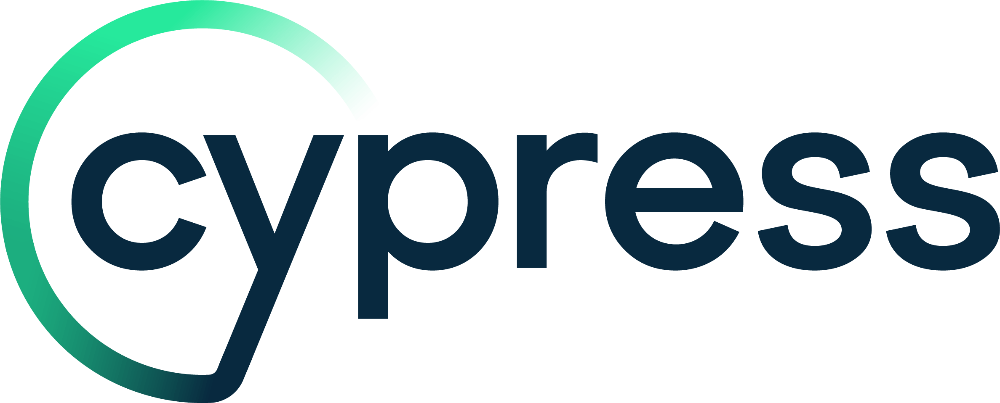
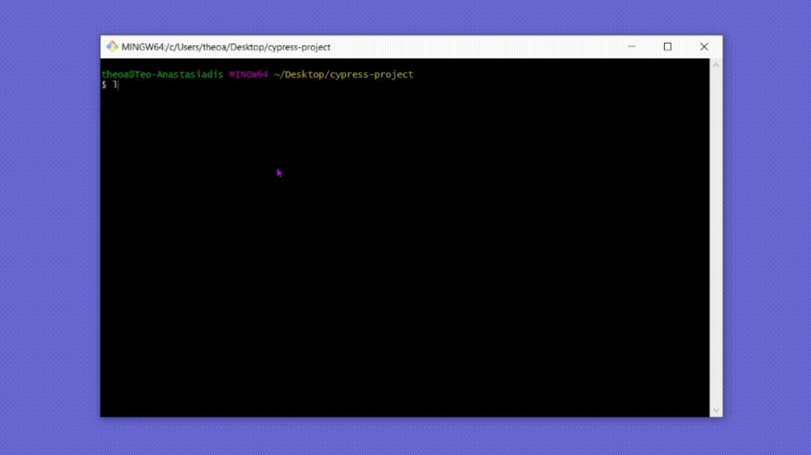

<p align="center">
  <a href="https://www.cypress.io">
    <picture>
      <source media="(prefers-color-scheme: dark)"  srcset="./assets/cypress-logo-dark.png">
      <source media="(prefers-color-scheme: light)" srcset="./assets/cypress-logo-light.png">
      
    </picture>
  </a>
</p>
<p align="center">
  <a href="https://on.cypress.io">Documentation</a> |
  <a href="https://on.cypress.io/changelog">Changelog</a> |
  <a href="https://on.cypress.io/roadmap">Roadmap</a>
</p>

<h3 align="center">
  The web has evolved. Finally, testing has too.
</h3>

<p align="center">
  Fast, easy and reliable testing for anything that runs in a browser.
</p>
<p align="center">
  Join us, we're <a href="https://cypress.io/jobs">hiring</a>.
</p>

<p align="center">
  <a href="https://www.npmjs.com/package/cypress">
    
  </a>
  <a href="https://on.cypress.io/discord">
    
  </a>
    <a href="https://stackshare.io/cypress">
    
  </a><br />
</p>

## What is Cypress?

<p align="center">
  <a href="https://player.vimeo.com/video/237527670">
    
  </a>
</p>

## Installing

[](https://badge.fury.io/js/cypress)

Install Cypress for Mac, Linux, or Windows, then [get started](https://on.cypress.io/install).

```bash
npm install cypress --save-dev
```
or
```bash
yarn add cypress --dev
```
or
```bash
pnpm add cypress --save-dev
```



## Contributing

[](https://cloud.cypress.io/projects/ypt4pf/runs)
[](https://circleci.com/gh/cypress-io/cypress/tree/develop) -  `develop` branch

Please see our [Contributing Guideline](./CONTRIBUTING.md) which explains repo organization, linting, testing, and other steps.

## License

[](https://github.com/cypress-io/cypress/blob/develop/LICENSE)

This project is licensed under the terms of the [MIT license](/LICENSE).

## Badges

Configure a badge for your project's README to show your test status or test count in the [Cypress Cloud](https://www.cypress.io/cloud).

[](https://cloud.cypress.io/projects/ypt4pf/runs)

[](https://cloud.cypress.io/projects/ypt4pf/runs)

Or let the world know your project is using Cypress with the badge below.

[](https://www.cypress.io/)

```
[](https://www.cypress.io/)
```


## 🌐 Web Resources & Interactive Index
- [OBBY HALLOWEEN DANGER SKATE](https://skillplay.github.io/obby-halloween-danger-skate.html)
- [ART SALON](https://studyplaying.github.io/art-salon.html)
- [CATEGORY BIKE 2](https://studyplayings.web.app/category-bike-2.html)
- [WATERPARK SORT](https://quizverses.github.io/waterpark-sort.html)
- [SQUID SPRUNKI SLITHER GAME 2](https://studyplayings.web.app/squid-sprunki-slither-game-2.html)
- [RAGDOLL FOOTBALL 2 PLAYERS](https://studyplayings.web.app/ragdoll-football-2-players.html)
- [PANDA LU TREEHOUSE](https://thelearnquesters.pages.dev/panda-lu-treehouse.html)
- [TAP BLOCK PUZZLE SMASH GAME](https://thelearnquesters.pages.dev/tap-block-puzzle-smash-game.html)
- [CATEGORY SCHOOL](https://studyplaying.github.io/category-school.html)
- [CATEGORY PREMIUM PERKS74](https://studyplayings.pages.dev/category-premium-perks74.html)
- [CATEGORY MINECRAFT](https://studyquests.github.io/category-minecraft.html)
- [IDLE LEGEND](https://studyplaying.github.io/idle-legend.html)
- [CATEGORY SPOT THE DIFFERENCE6](https://studyplayings.pages.dev/category-spot-the-difference6.html)
- [ELLIE AND FRIENDS VENICE CARNIVAL](https://studyplayings.pages.dev/ellie-and-friends-venice-carnival.html)
- [DRAWER SORT](https://thelearnquesters.pages.dev/drawer-sort.html)
- [OCEAN KIDS BACK TO SCHOOL](https://quizverses.pages.dev/ocean-kids-back-to-school.html)
- [CATEGORY UNBLOCK](https://studyplayings.pages.dev/category-unblock.html)
- [CATEGORY NETSUPPORT](https://thequizzone.pages.dev/category-netsupport.html)
- [BLOCKPUZZLE COLOR BLAST](https://studyplayings.pages.dev/blockpuzzle-color-blast.html)
- [ESCAPE OR DIE TROLL DEVIL LEVELS](https://studyplayings.pages.dev/escape-or-die-troll-devil-levels.html)
- [OREPLICATION](https://studyplaying.github.io/oreplication.html)
- [STICKMAN SHOOTER BROS](https://studyquests.pages.dev/stickman-shooter-bros.html)
- [FEED ME MONSTERS IDLE BATTLE](https://studyplayings.pages.dev/feed-me-monsters-idle-battle.html)
- [CATEGORY STORY45](https://studyplaying.github.io/category-story45.html)
- [FISH EAT GROW MEGA](https://studyplayings.pages.dev/fish-eat-grow-mega.html)
- [TROPICAL MATCH 2](https://studyplayings.pages.dev/tropical-match-2.html)
- [STYLE ICONS 2024 REWIND EDITION](https://thelearnquester.web.app/style-icons-2024-rewind-edition.html)
- [MYSTIC OBJECT HUNT](https://learnquester.pages.dev/mystic-object-hunt.html)
- [WORD GAME 2026](https://learnquester.github.io/word-game-2026.html)
- [ROBOTS GONE WILD](https://thelearnquesters.pages.dev/robots-gone-wild.html)
- [CATEGORY SNAKE40](https://thelearnquesters.pages.dev/category-snake40.html)
- [MAX CRUSHER 2 DESTRUCTION DRIFT AND RACING](https://studyplaying.github.io/max-crusher-2-destruction-drift-and-racing.html)
- [CATEGORY SIMULATION 3](https://studyplaying.github.io/category-simulation-3.html)
- [BALL TOWER OF HELL](https://quizverses.github.io/ball-tower-of-hell.html)
- [CATEGORY MISSION207](https://quizverses.github.io/category-mission207.html)
- [COIN MERGE MACHINE](https://learnquester.github.io/coin-merge-machine.html)
- [CONSTRUCTION TRUCK BUILDING GAMES FOR KIDS](https://studyplayings.pages.dev/construction-truck-building-games-for-kids.html)
- [SUPER SWING](https://thelearnquesters.pages.dev/super-swing.html)
- [WITCHY AND THE PUZZLE ADVENTURES](https://studyplaying.github.io/witchy-and-the-puzzle-adventures.html)
- [CATEGORY INTERSTELLARNETWORK](https://learnquester.github.io/category-interstellarnetwork.html)
- [GUN WAR Z1](https://studyplayings.pages.dev/gun-war-z1.html)
- [CELEBRITY SPRING MANICURE DESIGN](https://learnquester.github.io/celebrity-spring-manicure-design.html)
- [TURNFIGHT COM UAP](https://studyplayings.web.app/turnfight-com-uap.html)
- [MONSTER ARENA](https://quizverses.github.io/monster-arena.html)
- [2048 DROP MERGE](https://quizverses.github.io/2048-drop-merge.html)
- [TREASURE HUNT PUZZLE](https://studyplayings.pages.dev/treasure-hunt-puzzle.html)
- [MAGIC AND WIZARDS MATCH](https://studyplaying.github.io/magic-and-wizards-match.html)
- [MY PERFECT FARM](https://studyplaying.github.io/my-perfect-farm.html)
- [JELLY RUN 2048](https://thelearnquesters.pages.dev/jelly-run-2048.html)
- [INDEX23](https://thequizzone.pages.dev/index23.html)
- [MY FARM EMPIRE](https://studyplaying.github.io/my-farm-empire.html)
- [CATEGORY DRAGON22](https://quizverses.github.io/category-dragon22.html)
- [ROOM SORT FLOOR PLAN](https://learnquesters.pages.dev/room-sort-floor-plan.html)
- [CATEGORY SOCCER60](https://learnquester.github.io/category-soccer60.html)
- [ZOMBIE RAFT](https://studyquests.pages.dev/zombie-raft.html)
- [IDLE MERGE CAR AND RACE](https://studyplayings.pages.dev/idle-merge-car-and-race.html)
- [NIGHT CLUB SECURITY](https://quizverses.github.io/night-club-security.html)
- [ARROW SLIDE PUZZLE](https://quizverses.pages.dev/arrow-slide-puzzle.html)
- [MAGIC TILES 3](https://learnquester.pages.dev/magic-tiles-3.html)
- [SHINY JEWELS](https://thelearnquesters.pages.dev/shiny-jewels.html)
- [GOING BALLS 3D](https://quizverses.github.io/going-balls-3d.html)
- [PRIVACY](https://cryptotify.vercel.app/privacy.html)
- [RAGDOLL JUMP](https://studyplayings.web.app/ragdoll-jump.html)
- [AVATAR LIFE MY TOWN](https://quizverses.pages.dev/avatar-life-my-town.html)
- [RESIDENT EVIL PURGE OPERATION](https://quizverses.pages.dev/resident-evil-purge-operation.html)
- [GODS MIXER](https://studyquesthub.web.app/gods-mixer.html)
- [KAWAII FRIENDS TILES MATCHER](https://studyplayings.pages.dev/kawaii-friends-tiles-matcher.html)
- [CATEGORY POOL 3](https://thelearnquesters.pages.dev/category-pool-3.html)
- [CATEGORY ROGUELIKE38](https://learnquester.github.io/category-roguelike38.html)
- [TERMS](https://quizverses.github.io/terms.html)
- [AGARIO](https://studyquests.pages.dev/agario.html)
- [CATEGORY 2D1 060](https://studyquests.pages.dev/category-2d1-060.html)
- [ONET MONSTER BOOK](https://quizverses.pages.dev/onet-monster-book.html)
- [HAPPY BROTHERS](https://thelearnquesters.pages.dev/happy-brothers.html)
- [CATEGORY PROXIES](https://learnquester.github.io/category-proxies.html)
- [COSMOS 404](https://quizverses.pages.dev/cosmos-404.html)
- [WORD JAM ASSOCIATION PUZZLE](https://studyplayings.pages.dev/word-jam-association-puzzle.html)
- [BID WARS 1 AUCTION SIMULATOR](https://learnquester.github.io/bid-wars-1-auction-simulator.html)
- [FIND GOODS](https://themindplay.github.io/find-goods.html)
- [EMOJI SMASHER SMILEY GAME](https://learnquester.github.io/emoji-smasher-smiley-game.html)
- [TERMS](https://brainquests-fb2c5.web.app/terms.html)
- [SUDOKU VAULT](https://quizverses.github.io/sudoku-vault.html)
- [ELYTRA FLIGHT](https://studyplaying.github.io/elytra-flight.html)
- [CUTE CRAFT LAB](https://studyquests.github.io/cute-craft-lab.html)
- [FLAG PUZZLE JAM COLLECT FLAGS](https://learnquester.github.io/flag-puzzle-jam-collect-flags.html)
- [BATTLE TANKS FIRESTORM](https://theskillquest.pages.dev/battle-tanks-firestorm.html)
- [BLOCKIBO COLOR BLOCKS](https://studyplayings.pages.dev/blockibo-color-blocks.html)
- [MR LONG HAND](https://thequizzone.pages.dev/mr-long-hand.html)
- [TILE MATCH THE IMMERSIVE PUZZLE](https://themindzone.pages.dev/tile-match-the-immersive-puzzle.html)
- [CATEGORY DRESS UP 2](https://themindzone.pages.dev/category-dress-up-2.html)
- [MISSION SANTA DELIVER THE GIFTS](https://studyplaying.github.io/mission-santa-deliver-the-gifts.html)
- [BLOCK EATING SIMULATOR](https://studyquests.pages.dev/block-eating-simulator.html)
- [GEOMETRY OPEN WORLD](https://studyplaying.github.io/geometry-open-world.html)
- [CATEGORY BUSINESS137](https://themindzone.pages.dev/category-business137.html)
- [CATEGORY HERO](https://thelearnquesters.pages.dev/category-hero.html)
- [PUMPKIN PATCH](https://thequizzone.pages.dev/pumpkin-patch.html)
- [ESCAPE FROM TUNG TUNG SAHUR](https://thequizzone.pages.dev/escape-from-tung-tung-sahur.html)
- [MEOW SLIDE](https://learnquesters.pages.dev/meow-slide.html)
- [TOWER STACK 2026](https://themindzone.pages.dev/tower-stack-2026.html)
- [ANIMAL BLOCKS](https://themindzone.pages.dev/animal-blocks.html)
- [CATEGORY SPORTS](https://themindzone.pages.dev/category-sports.html)
- [DUCK HUNTING OPEN SEASON](https://themindzone.pages.dev/duck-hunting-open-season.html)
- [DOT BY DOT](https://thequizzone.pages.dev/dot-by-dot.html)
- [BOXING FIGHTER](https://themindzone.pages.dev/boxing-fighter.html)
- [CATEGORY RESTAURANT64](https://studyquesthub.web.app/category-restaurant64.html)
- [FANTASY MATH NUMBER](https://studyquests.pages.dev/fantasy-math-number.html)
- [MAX MIXED COCKTAILS](https://themindzone.pages.dev/max-mixed-cocktails.html)
- [CATEGORY RAGDOLL57](https://themindzone.pages.dev/category-ragdoll57.html)
- [INDEX26](https://themindzone.pages.dev/index26.html)
- [PRIVACY](https://cryptotify.pages.dev/privacy.html)
- [TANKS](https://themindzone.pages.dev/tanks.html)
- [BOUNCY BLOB RACE OBSTACLE COURSE](https://thelearnquesters.pages.dev/bouncy-blob-race-obstacle-course.html)
- [CATEGORY SNAKE40](https://themindzone.pages.dev/category-snake40.html)
- [X TO Y ALMOST IMPOSSIBLE](https://studyplayings.pages.dev/x-to-y-almost-impossible.html)
- [CONSTRUCTION TRUCK BUILDING GAMES FOR KIDS](https://thequizzone.pages.dev/construction-truck-building-games-for-kids.html)
- [MUSIC CAT PIANO TILES GAME 3D](https://quizverses.pages.dev/music-cat-piano-tiles-game-3d.html)
- [CATEGORY DRESS UP97](https://themindzone.pages.dev/category-dress-up97.html)
- [CATEGORY CONTROLLER59](https://thequizzone.pages.dev/category-controller59.html)
- [MAGIC SORTING](https://thequizzone.pages.dev/magic-sorting.html)
- [CATEGORY STICKMAN](https://learnquester.github.io/category-stickman.html)
- [3D KID SLIDING PUZZLE](https://thequizzone.pages.dev/3d-kid-sliding-puzzle.html)
- [CATEGORY STRATEGY](https://themindzone.pages.dev/category-strategy.html)
- [INDEX23](https://themindzone.pages.dev/index23.html)
- [CATEGORY WATER39](https://themindzone.pages.dev/category-water39.html)
- [CITY BANANA MAN AGENT](https://thelearnquesters.pages.dev/city-banana-man-agent.html)
- [LORENZO THE RUNNER](https://quizverses.pages.dev/lorenzo-the-runner.html)
- [AVATAR MAKE UP](https://thelearnquesters.pages.dev/avatar-make-up.html)
- [CATEGORY CASUAL 16](https://themindzone.pages.dev/category-casual-16.html)
- [CATEGORY SIMULATION 4](https://themindzone.pages.dev/category-simulation-4.html)
- [MOTO TRIALS RUSH](https://themindzone.pages.dev/moto-trials-rush.html)
