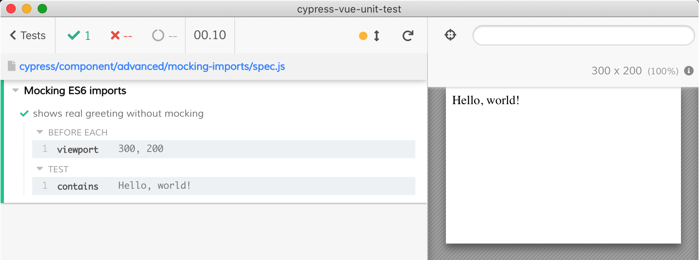

# Mocking ES6 imports

Vue component in [Hello.vue](Hello.vue) imports a named ES6 import from [greeting.js](greeting.js). From the test [spec.js](spec.js) we can mock that import to make testing simpler.

Compare no mocking

