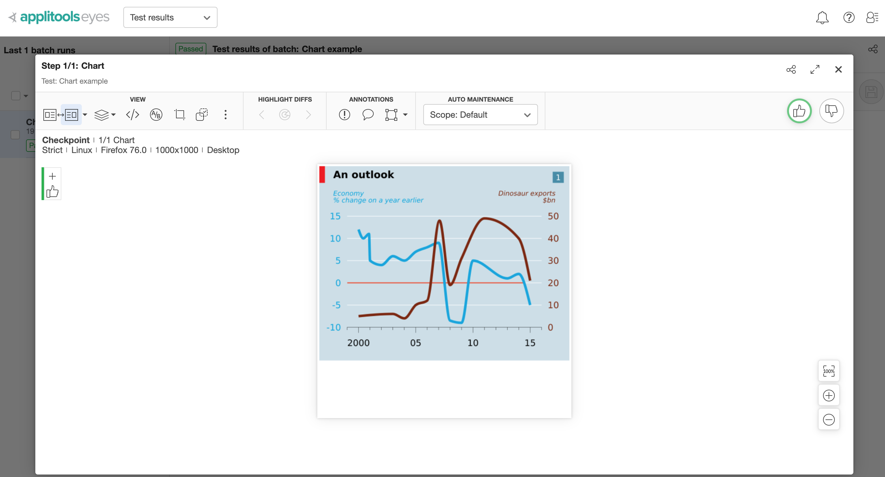

# example: visual testing using Applitools

Shows how to use Applitools to visually check React charts made with [Victory](https://formidable.com/open-source/victory/) library.

See [src/Chart.spec.js](src/Chart.spec.js)

The `cy.eyes*` commands are ignored during local interactive run. On CI, the `cy.eyes*` send the snapshots to Applitools servers to be analyzed and compared against the baseline images.

For more information, see [Applitools tutorial](https://applitools.com/tutorials/cypress.html)
