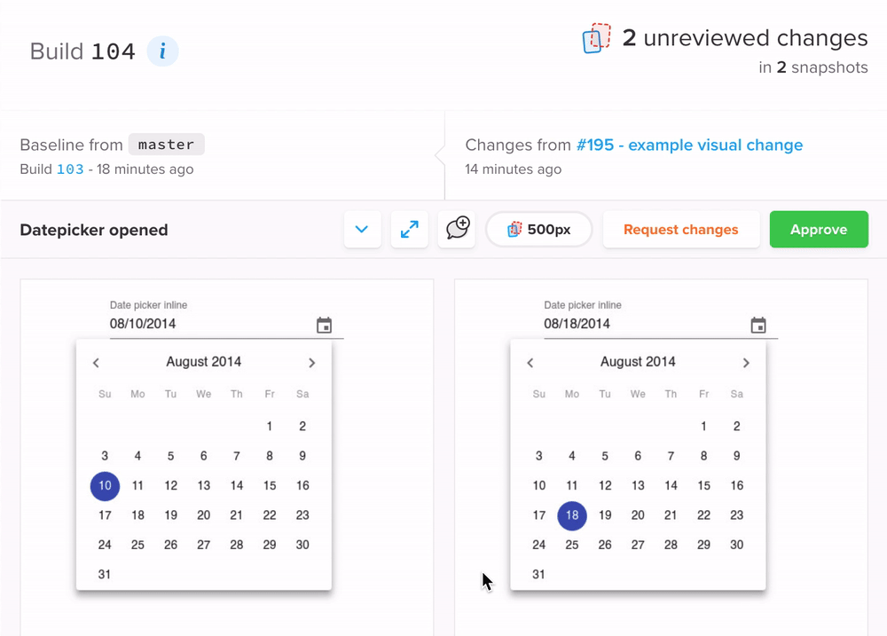

# example: visual-testing [](https://percy.io/bahmutov/cypress-react-unit-test)

Uses [@percy/cypress](https://github.com/percy/percy-cypress) to run visual tests for a demo of Material UI date pickers from https://material-ui.com/components/pickers/. Every pull request shows the visual diff (if any) and allows us to confirm that styles and layouts have not changed.

Note: run `npm install` in this folder to symlink `cypress-react-unit-test` dependency.

The project was set up using Percy documentation (see support and plugins files). The example spec [src/DatePicker.cy-spec.js](src/DatePicker.cy-spec.js) runs `cy.percySnapshot` after confirming the DOM has updated.

```js
mount(<MaterialUIPickers />)
// confirm the DOM has rendered the widget
cy.get('#date-picker-inline').should('have.value', '08/18/2014')
// then take visual snapshot
cy.percySnapshot('Datepicker initial')

cy.get('button[aria-label="change date"]').click()
// confirm the DOM has rendered the widget
cy.get('.MuiPickersBasePicker-container').should('be.visible')
// then take visual snapshot
cy.percySnapshot('Datepicker opened')
```

### New screenshot


### Visual change

If a pull request introduces visual changes, they are caught and shown as a diff



**Tip:** you can use any [visual testing](https://on.cypress.io/visual-testing) plugin with component testing.
