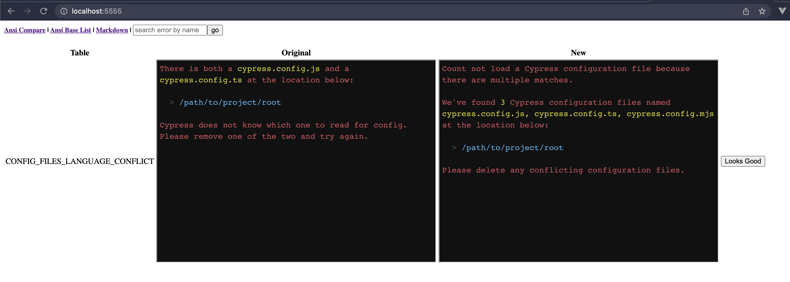

## Error Handling in Cypress

Clear, consistent, errors are one of the important parts of the Cypress experience. When something goes wrong, there should be clear, actionable feedback for the user about exactly *what* went wrong, *where* it went wrong, and next steps on how to fix.

### @packages/errors

All error related logic for the server should be added to `@packages/errors`. This logic has been separated out from the `@packages/server` to enable strict type checking & use in other packages we have added in the `10.0-release` branch.

### Errors Development Workflow

Adding and editing errors is best done with the help of the Error Comparison tool.

Start off by launching the Error Comparison tool from `packages/errors` via `yarn comparison`. This will launch a mini-webapp at http://localhost:5555.

The Error Comparison app has three pages: Ansi Compare, Ansi Base List, and Markdown.

1. Ansi Compare - Used to compare and accept changes made during development
2. Ansi Base List - Used to preview errors as they will be rendered to users in the Terminal.
3. Markdown - Used to preview errors as they will be rendered to users within the App, Launchpad, and Reporter.

#### Editing or Adding New Errors and Updating Snapshots



1. Add (or update) errors in `packages/errors/src/errors.ts`
2. Add test cases to `visualSnapshotErrors_spec.ts`
3. Run `yarn test` in the `packages/errors` directory
4. Run `yarn comparison` in the `packages/errors` directory
5. Open http://localhost:5555/
6. Search for the error you're working on by the error key. (e.g. `AUTOMATION_SERVER_DISCONNECTED`)
7. Click "Looks Good" if it looks good.
8. To make edits, re-run the `yarn test` command and do a full refresh of the webapp.
9. Run `yarn test` after updating the snapshot to validate the changes were applied.
10. Commit the files changed in `__snapshot-html__`

### Technical Overview

- `errors.ts`: A key/value mapping of known errors to functions returning "ErrorTemplates", described below, also includes/re-exports several helper utilities:
  - `get` / `getError`: builds & retrieves the error as a `CypressError`, should be the main way we retrieve errors throughout Cypress. Aliased as `errors.get` for existing use in the server package
  - `throw` / `throwErr`: Get & throw the error, so we can spy/stub it in a test. Aliased as `errors.throwErr` for existing use in the server package
  - `logWarning`: Logs the error as a warning to the console, aliased as `errors.log` for existing use in the server package
- `errTemplate.ts`: Tagged template literal formatting the error as described below
- `stackUtils.ts`: Utilities for working with a stack trace, extended by the driver package

### errTemplate

The `errTemplate` is a tagged template literal. It allows us to maintain consistent behavior & formatting in our error messages, when we see a variable, we format it depending on the target environment.

The error message returns a message that defaults to being formatted for the terminal, and has a `forBrowser` method which returns the error message where the variables are wrapped in backticks '`' for Markdown display in the browser.

Return Value of `errTemplate` (`ErrTemplateResult`):

```ts
{
  // Will always exist, this is the terminal-formatted error message
  message: string,
  // Will always exist, this is the browser-formatted error message
  messageMarkdown: string,
  details?: string, // Exists if there is `details()` call in the errTemplate
  originalError?: ErrorLike // Exists if an error was passed into the `details()`
}
```

#### Example:

```ts
CANNOT_TRASH_ASSETS: (arg1: string) => {
  return errTemplate`\
      Warning: We failed to trash the existing run results.

      This error will not affect or change the exit code.

      ${details(arg1)}`
},
```

In this case, `arg1` will be highlighted in yellow when printed to the terminal.


```ts
PLUGINS_FILE_ERROR: (arg1: string, arg2: Error) => {
  return errTemplate`\
      The plugins file is missing or invalid.

      Your \`pluginsFile\` is set to ${arg1}, but either the file is missing, it contains a syntax error, or threw an error when required. The \`pluginsFile\` must be a \`.js\`, \`.ts\`, or \`.coffee\` file.

      Or you might have renamed the extension of your \`pluginsFile\`. If that's the case, restart the test runner.

      Please fix this, or set \`pluginsFile\` to \`false\` if a plugins file is not necessary for your project.

      ${details(arg2)}
    `
},
```

`arg1` will be highlighted in `blue` for the terminal, and wrapped in backticks when called with `forBrowser`. Details will be printed in `yellow` as a stack trace when printed to the terminal, or shown as a stack-trace in the browser.

### Error Wrapping

Any time we know about an edge case that is an error, we should define an error in `errors.ts`. This error should be retrieved by `getError`, which converts it to a `CypressError`.

The `CypressError` is an `Error` containing the message returned from the `errTemplate`. The `stack` is set to that of the `originalError` if it exists (i.e. the error object passed into `details`), otherwise it's the `stack` from where the `getError` / `throwError` is called.


The `CypressError` has an `isCypressErr` prop which we use as a duck-type guard against exiting the process when logging exceptions. It also maintains a reference to the `originalError` if it exists.

### Child-Process Errors

All errors that occur in a child process spawned by Cypress should be sent over the `ipc` bridge using `util.serializeError`.

This ensures the `name`, `message`, `stack`, and any other relevant details are preserved and can be handled by the standard process of Cypress' error standardization / wrapping.