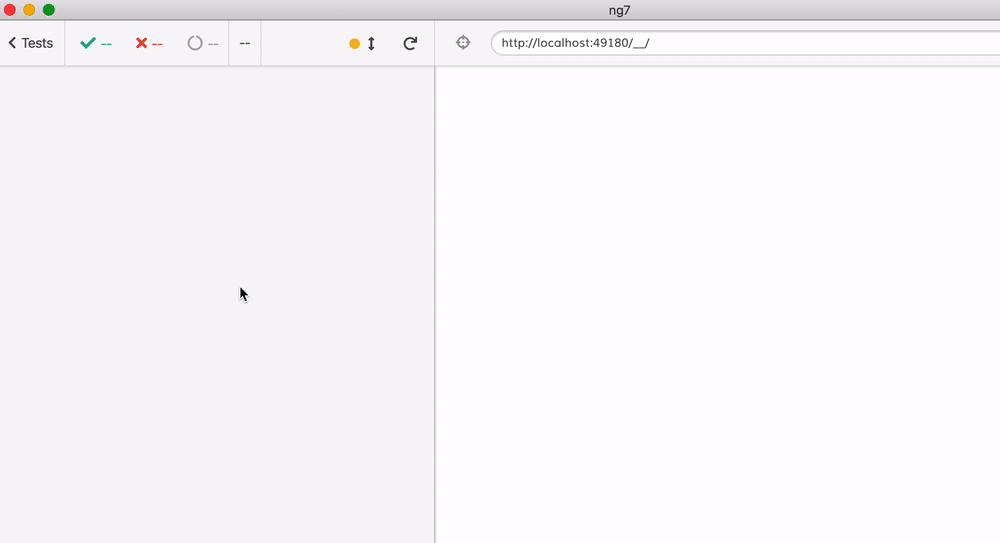

# cypress-angular-unit-test

[](https://badge.fury.io/js/cypress-angular-unit-test) [![renovate-app badge][renovate-badge]][renovate-app]  [![ci status][ci image]][ci url] [](https://dashboard.cypress.io/projects/nf7zag/runs)

## Installation

```shell
npm install -D cypress cypress-angular-unit-test @cypress/webpack-preprocessor
```

Add to your support file

```js
// cypress/support/index.js
// core-js 3.*
require('core-js/es/reflect');
// core-js 2.*
require('core-js/es7/reflect');
require('cypress-angular-unit-test/support');
```

Enable experimental component testing mode in `cypress.json` and point at the spec files. Usually they are alongside your application files in `src` folder.

```json
{
  "experimentalComponentTesting": true,
  "componentFolder": "src",
  "testFiles": "**/*cy-spec.*"
}
```

Configure `cypress/plugins/index.js` to transpile Angular code.

```javascript
import * as cypressTypeScriptPreprocessor from './cy-ts-preprocessor';
module.exports = (on, config) => {
  on('file:preprocessor', cypressTypeScriptPreprocessor);
  return config;
};
```

The file `cy-ts-preprocessor` is [here](cypress/plugins/cy-ts-preprocessor.ts)

## Use

```js
import { mount } from 'cypress-angular-unit-test';
import { AppComponent } from './app.component';

describe('AppComponent', () => {
  it('shows the input', () => {
    // Init Angular stuff
    initEnv(AppComponent);
    // You can also :
    // initEnv({declarations: [AppComponent]});
    // initEnv({imports: [MyModule]});

    // component + any inputs object
    mount(AppComponent, { title: 'World' });
    // use any Cypress command afterwards
    cy.contains('Welcome to World!');
  });
});
```



## Examples

| Use case                                             | Description                                                                                  |
| ---------------------------------------------------- | -------------------------------------------------------------------------------------------- |
| [Input](src/app/input)                               | Test inject `@Input()` value                                                                 |
| [Output](src/app/output-subscribe)                   | Test catching `@Output()`                                                                    |
| [Bootstrap](src/app/bootstrap-button)                | Bootstrap integration with style : `setConfig({ stylesheet: 'https://...});`                 |
| [Add style](src/app/add-style)                       | Add custom style for testing : `setConfig({ style: 'p {background-color: blue;}' });`        |
| [HTML mount](src/app/html-mount)                     | Mount a component with html, don't forget to call `detectChanges()` after                    |
| [Image Snapshot](src/app/image-snapshot)             | Mount a component and visual asserting                                                       |
| [Material](src/app/material-button)                  | Material integration                                                                         |
| [Prime NG](src/app/primeng-button)                   | PrimeNG integration                                                                          |
| [OnPush strategy](src/app/on-push-strat)             | Component with `changeDetection: ChangeDetectionStrategy.OnPush` need call `detectChanges()` |
| [Directive](src/app/directives/highlight)            | Test directive with mountHtml                                                                |
| [Pipe](src/app/pipes/capitalize)                     | Test pipe with mountHtml                                                                     |
| [Stub service](src/app/service-stub)                 | Stub a service with Observable                                                               |
| [Only service](src/app/my-values.service.cy-spec.ts) | Test a service without a component                                                           |
| [Web Component](src/app/use-custom-element)          | Test a custom element with shadow dom                                                        |
| [Assets](src/app/assets-image)                       | `assets` folder accessible by Cypress                                                        |
| [Async](src/app/timeout)                             | Async test with `cy.tick`                                                                    |
| [Routing](src/app/routing)                           | Test routing link                                                                            |

## Code coverage

### Integration test

- Install ngx-build-plus to extends the Angular CLI's build process and instrument the code

`npm i -D ngx-build-plus`

- Add webpack coverage config file coverage.webpack.js to cypress folder

```javascript
module.exports = {
  module: {
    rules: [
      {
        test: /\.(js|ts)$/,
        loader: 'istanbul-instrumenter-loader',
        options: { esModules: true },
        enforce: 'post',
        include: require('path').join(__dirname, '..', 'src'),
        exclude: [
          /\.(e2e|spec)\.ts$/,
          /node_modules/,
          /(ngfactory|ngstyle)\.js/,
        ],
      },
    ],
  },
};
```

- Update `angular.json` to use ngx-build with extra config

```json
"serve": {
  "builder": "ngx-build-plus:dev-server",
  "options": {
    "browserTarget": "cypress-angular-coverage-example:build",
    "extraWebpackConfig": "./cypress/coverage.webpack.js"
  },
}
```

- Instrument JS files with istanbul for code coverage reporting

`npm i -D istanbul-instrumenter-loader`

- Add cypress code coverage plugin

`npm install -D @cypress/code-coverage`

- Then add the code below to your supportFile and pluginsFile

```javascript
// cypress/support/index.js
import '@cypress/code-coverage/support';
// cypress/plugins/index.js
module.exports = (on, config) => {
  require('@cypress/code-coverage/task')(on, config);
  return config;
};
```

source : <https://github.com/skylock/cypress-angular-coverage-example>

### Unit test

- Instrument JS files with istanbul for code coverage reporting

`npm i -D istanbul-instrumenter-loader`

- In your `cypress/plugins/cy-ts-preprocessor.ts` add this rule

```javascript
rules: [
  {
    test: /\.(js|ts)$/,
    loader: 'istanbul-instrumenter-loader',
    options: { esModules: true },
    enforce: 'post',
    include: path.join(__dirname, '../..', 'src'),
    exclude: [/\.(e2e|spec)\.ts$/, /node_modules/, /(ngfactory|ngstyle)\.js/],
  },
];
```

### Report

You can find the HTML report at `coverage/lcov-report/index.html`

## Working

I have successfully used this mounting approach to test components in other frameworks.

- [cypress-vue-unit-test](https://github.com/bahmutov/cypress-vue-unit-test)
- [cypress-react-unit-test](https://github.com/bahmutov/cypress-react-unit-test)
- [cypress-cycle-unit-test](https://github.com/bahmutov/cypress-cycle-unit-test)
- [cypress-svelte-unit-test](https://github.com/bahmutov/cypress-svelte-unit-test)
- [cypress-angular-unit-test](https://github.com/bahmutov/cypress-angular-unit-test)
- [cypress-hyperapp-unit-test](https://github.com/bahmutov/cypress-hyperapp-unit-test)
- [cypress-angularjs-unit-test](https://github.com/bahmutov/cypress-angularjs-unit-test)

## Debugging

You can turn on debugging log by setting environment variable :

```bash
// Unix
export DEBUG="cypress-angular-unit-test,cypress:webpack:stats"

// PowerShell
$env:DEBUG="cypress-angular-unit-test,cypress:webpack:stats"
```

## Development

This project only transpiles the library, to see it in action:

- Install dependencies `npm i`
- Compile the library `npm run build`
- Open Cypress with `npx cypress open`

Pick any component test spec file to run

[renovate-badge]: https://img.shields.io/badge/renovate-app-blue.svg
[renovate-app]: https://renovateapp.com/
[ci image]: https://github.com/bahmutov/cypress-angular-unit-test/workflows/ci/badge.svg?branch=master
[ci url]: https://github.com/bahmutov/cypress-angular-unit-test/actions
