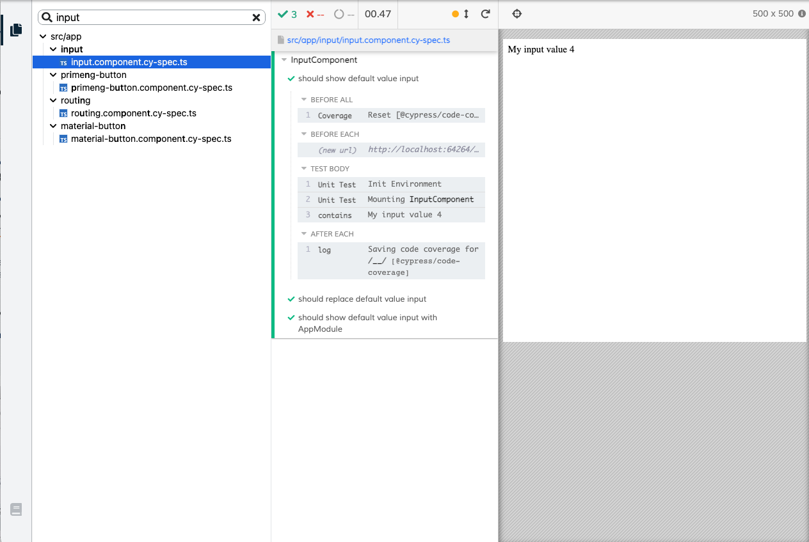

# @cypress/angular

## Installation

NOTE: this is not published on npm yet. It's a work in progress. Consider [Cypress Angular
](https://github.com/jscutlery/test-utils/tree/main/packages/cypress-angular) by [JS Cutlery](https://github.com/jscutlery) for a version that's currently working and available on npm.

```shell
npm install -D cypress @cypress/angular @cypress/webpack-dev-server
```

Ensure you have a version of Cypress > 7. 

Add the following to your support file:

```js
// cypress/support/component.js
// core-js 3.*
require('core-js/es/reflect');
// core-js 2.*
require('core-js/es7/reflect');
require('@cypress/angular/support');
```

Enable component testing in `cypress.config.js`.

```js
module.exports = {
  "component": {
    "componentFolder": "src/app",
    "testFiles": "**/*cy-spec.ts"
  }
}
```

Configure `cypress/plugins/index.js` to transpile Angular code.

```javascript
import * as webpackConfig from './webpack.config';
const { startDevServer } = require('@cypress/webpack-dev-server');

module.exports = (on, config) => {
  on('dev-server:start', (options) =>
    startDevServer({
      options,
      webpackConfig,
    }),
  );
  return config;
};
```

The `webpack.config.ts` file is [here](cypress/plugins/webpack.config.ts).

## Use

```js
import { initEnv, mount } from '@cypress/angular'
import { AppModule } from '../app.module'
import { InputComponent } from './input.component'

describe('InputComponent', () => {
  it('should show default value input', () => {
    initEnv(InputComponent)
    mount(InputComponent)
    cy.contains('My input value 4')
  })

  it('should replace default value input', () => {
    initEnv({ declarations: [InputComponent] })
    mount(InputComponent, { myInput: 9 })
    cy.contains('My input value 9')
  })

  it('should show default value input with AppModule', () => {
    initEnv({ imports: [AppModule] })
    mount(InputComponent)
    cy.contains('My input value 4')
  })
})

```



## Examples

| Use case                                             | Description                                                                                  |
| ---------------------------------------------------- | -------------------------------------------------------------------------------------------- |
| [Input](src/app/input)                               | Test inject `@Input()` value                                                                 |
| [Output](src/app/output-subscribe)                   | Test catching `@Output()`                                                                    |
| [Bootstrap](src/app/bootstrap-button)                | Bootstrap integration with style : `setConfig({ stylesheet: 'https://...});`                 |
| [Add style](src/app/add-style)                       | Add custom style for testing : `setConfig({ style: 'p {background-color: blue;}' });`        |
| [HTML mount](src/app/html-mount)                     | Mount a component with html, don't forget to call `detectChanges()` after                    |
| [Image Snapshot](src/app/image-snapshot)             | Mount a component and visual asserting                                                       |
| [Material](src/app/material-button)                  | Material integration                                                                         |
| [Prime NG](src/app/primeng-button)                   | PrimeNG integration                                                                          |
| [OnPush strategy](src/app/on-push-strat)             | Component with `changeDetection: ChangeDetectionStrategy.OnPush` need call `detectChanges()` |
| [Directive](src/app/directives/highlight)            | Test directive with mountHtml                                                                |
| [Pipe](src/app/pipes/capitalize)                     | Test pipe with mountHtml                                                                     |
| [Stub service](src/app/service-stub)                 | Stub a service with Observable                                                               |
| [Only service](src/app/my-values.service.cy-spec.ts) | Test a service without a component                                                           |
| [Web Component](src/app/use-custom-element)          | Test a custom element with shadow dom                                                        |
| [Assets](src/app/assets-image)                       | `assets` folder accessible by Cypress                                                        |
| [Async](src/app/timeout)                             | Async test with `cy.tick`                                                                    |
| [Routing](src/app/routing)                           | Test routing link                                                                            |

## Code coverage

### Integration test

- Install ngx-build-plus to extends the Angular CLI's build process and instrument the code

`npm i -D ngx-build-plus`

- Add webpack coverage config file coverage.webpack.js to cypress folder

```javascript
module.exports = {
  module: {
    rules: [
      {
        test: /\.(js|ts)$/,
        loader: 'istanbul-instrumenter-loader',
        options: { esModules: true },
        enforce: 'post',
        include: require('path').join(__dirname, '..', 'src'),
        exclude: [
          /\.(e2e|spec)\.ts$/,
          /node_modules/,
          /(ngfactory|ngstyle)\.js/,
        ],
      },
    ],
  },
};
```

- Update `angular.json` to use ngx-build with extra config

```json
"serve": {
  "builder": "ngx-build-plus:dev-server",
  "options": {
    "browserTarget": "cypress-angular-coverage-example:build",
    "extraWebpackConfig": "./cypress/coverage.webpack.js"
  },
}
```

- Instrument JS files with istanbul for code coverage reporting

`npm i -D istanbul-instrumenter-loader`

- Add cypress code coverage plugin

`npm install -D @cypress/code-coverage`

- Then add the code below to your supportFile and pluginsFile

```javascript
// cypress/support/component.js
import '@cypress/code-coverage/support';
// cypress/plugins/index.js
module.exports = (on, config) => {
  require('@cypress/code-coverage/task')(on, config);
  return config;
};
```

source : <https://github.com/skylock/cypress-angular-coverage-example>

### Unit test

- Instrument JS files with istanbul for code coverage reporting

`npm i -D istanbul-instrumenter-loader`

- In your `cypress/plugins/cy-ts-preprocessor.ts` add this rule

```javascript
rules: [
  {
    test: /\.(js|ts)$/,
    loader: 'istanbul-instrumenter-loader',
    options: { esModules: true },
    enforce: 'post',
    include: path.join(__dirname, '../..', 'src'),
    exclude: [/\.(e2e|spec)\.ts$/, /node_modules/, /(ngfactory|ngstyle)\.js/],
  },
];
```

### Report

You can find the HTML report at `coverage/lcov-report/index.html`

## Debugging

You can turn on debugging log by setting environment variable :

```bash
// Unix
export DEBUG="@cypress/angular,cypress:webpack:dev-server"

// PowerShell
$env:DEBUG="@cypress/angular,cypress:webpack:dev-server"
```

## Development

This project only transpiles the library, to see it in action:

- Install dependencies `yarn`
- Compile the library `yarn build` or `yarn watch` for watch mode
- Open Cypress with `yarn cy:open`
