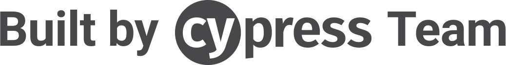

# Cypress Angular Schematic

<p align="center">
  <a href="https://cypress.io">
    
    </a>
</p>

Add [Cypress](https://cypress.io) to an Angular CLI project

This schematic will:

- install Cypress, its dependencies, and new scripts
- add necessary files for Cypress to work with Angular & Typescript
- prompt for removal of Protractor files and configuration

## Usage 🚀

Run as one command in an Angular CLI app directory. Note this will add the schematic as a dependency to your project.

```shell
ng add @cypress/schematic
```

With the custom builder installed, you can run cypress with the following commands:

```shell script
ng e2e
```

```shell script
ng run {your-project-name}:cypress-open
```

These two commands do the same thing. They will launch the (Electron) Cypress Test Runner in watch mode.

```shell script
ng run {your-project-name}:cypress-run
```

This command will open the (Electron) Cypress Test Runner and run your tests one time, with output to your terminal.

## Issues

Issues with this schematic can be filed [here](https://github.com/cypress-io/cypress-schematics/issues/new/choose).

## Getting started

### Prerequisites

The only requirement for this project is [Node.js](https://nodejs.org/en/).

TypeScript will be added as a local dependency to the project, so no need to install it.

### Installation

⬇ **Install** the dependencies for the schematic and the sandbox application

```shell
yarn install && cd sandbox && yarn install && cd ..
```

🖇 **Link** the schematic in the sandbox to run locally

```shell
yarn link:sandbox
```

🏃 **Run** the schematic

```shell
yarn build:clean:launch
```

### Testing

To test locally, use the `schematics` command line tool that is included locally. That tool acts the same as the `generate` command of the Angular CLI, but also has a debug mode.

Check the documentation with

```bash
schematics --help
```

### Unit & Integration Testing

`yarn test:schematics` will run the schematic unit tests, using Jasmine as a runner and test framework.
`yarn test:builders` will run the builder integration tests, linking the schematic, and installing Cypress into the sandbox to run the included Cypress spec.
