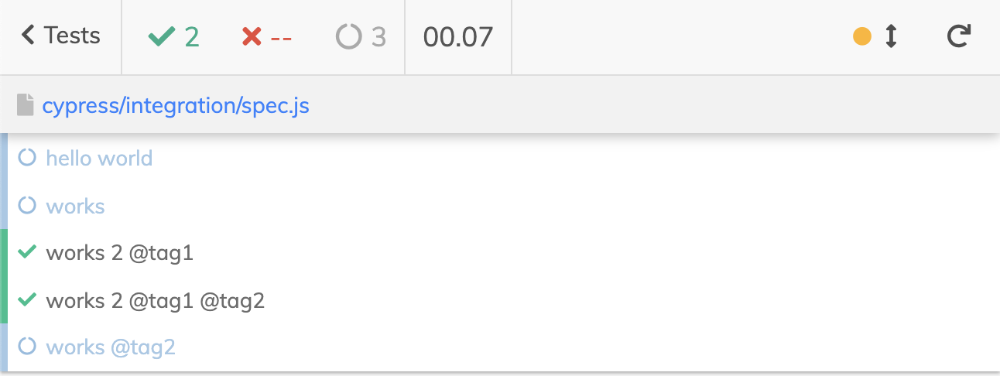
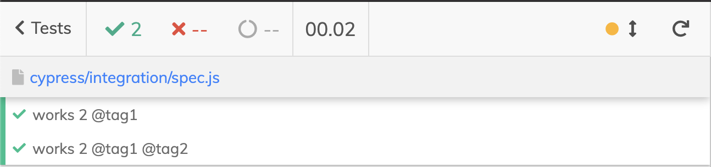
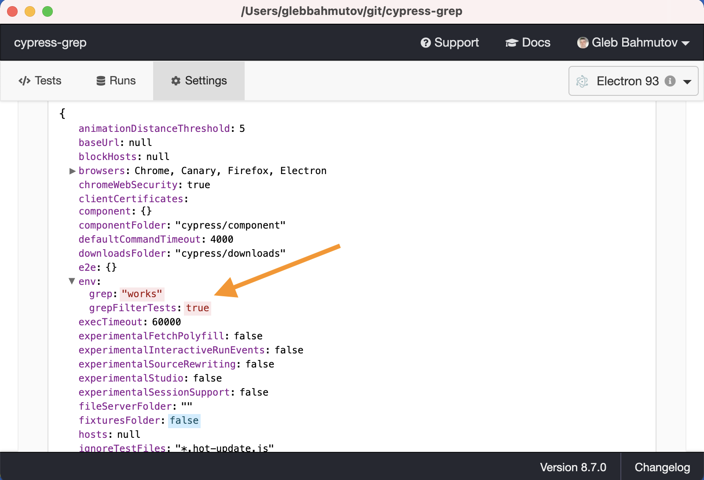
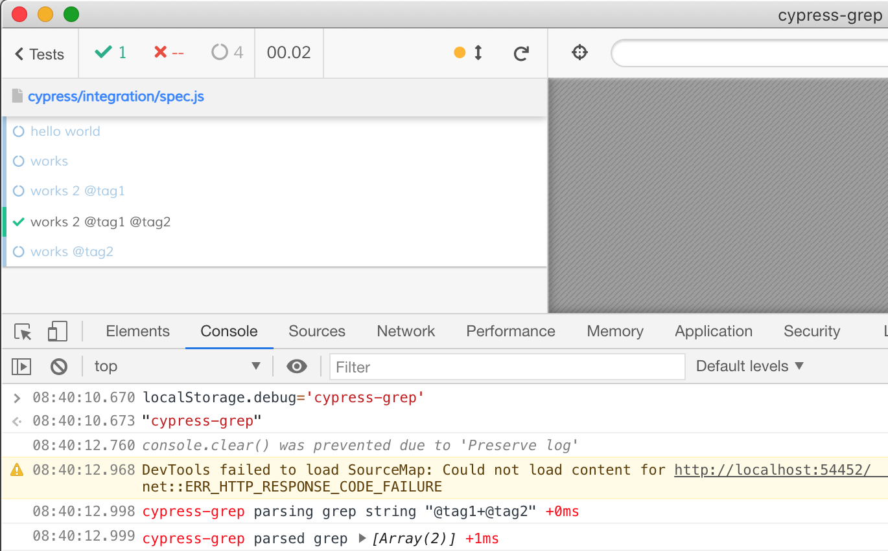

# @cypress/grep

> Filter tests using substring

```shell
# run only tests with "hello" in their names
npx cypress run --env grep=hello

  ✓ hello world
  - works
  - works 2 @tag1
  - works 2 @tag1 @tag2

  1 passing (38ms)
  3 pending
```

All other tests will be marked pending, see why in the [Cypress test statuses](https://on.cypress.io/writing-and-organizing-tests#Test-statuses) blog post.

If you have multiple spec files, all specs will be loaded, and every test will be filtered the same way, since the grep is run-time operation and cannot eliminate the spec files without loading them. If you want to run only specific tests, use the built-in [--spec](https://on.cypress.io/command-line#cypress-run-spec-lt-spec-gt) CLI argument.

Table of Contents

<!-- MarkdownTOC autolink="true" -->

- [Install](#install)
  - [Support file](#support-file)
  - [Config file](#config-file)
- [Usage Overview](#usage-overview)
- [Filter by test title](#filter-by-test-title)
  - [OR substring matching](#or-substring-matching)
  - [Test suites](#test-suites)
  - [Invert filter](#invert-filter)
- [Filter with tags](#filter-with-tags)
  - [Tags in the test config object](#tags-in-the-test-config-object)
  - [AND tags](#and-tags)
  - [OR tags](#or-tags)
  - [Inverted tags](#inverted-tags)
  - [NOT tags](#not-tags)
  - [Tags in test suites](#tags-in-test-suites)
  - [Grep untagged tests](#grep-untagged-tests)
- [Pre-filter specs \(grepFilterSpecs\)](#pre-filter-specs-grepfilterspecs)
- [Omit filtered tests \(grepOmitFiltered\)](#omit-filtered-tests-grepomitfiltered)
- [Disable grep](#disable-grep)
- [Burn \(repeat\) tests](#burn-repeat-tests)
- [TypeScript support](#typescript-support)
- [General advice](#general-advice)
- [DevTools console](#devtools-console)
- [Debugging](#debugging)
  - [Log messages](#log-messages)
  - [Debugging in the plugin](#debugging-in-the-plugin)
  - [Debugging in the browser](#debugging-in-the-browser)
- [Examples](#examples)
- [See also](#see-also)
- [Migration guide](#migration-guide)
  - [from v1 to v2](#from-v1-to-v2)
  - [from v2 to v3](#from-v2-to-v3)
- [Videos & Blog Posts](#videos--blog-posts)
- [Blog posts](#blog-posts)
- [Small print](#small-print)
- [MIT License](#mit-license)

<!-- /MarkdownTOC -->

## Install

Assuming you have Cypress installed, add this module as a dev dependency.

```shell
# using NPM
npm i -D @cypress/grep
# using Yarn
yarn add -D @cypress/grep
```

**Note**: @cypress/grep only works with Cypress version >= 10.

### Support file

**required:** load this module from the [support file](https://on.cypress.io/writing-and-organizing-tests#Support-file) or at the top of the spec file if not using the support file. You import the registration function and then call it:

```js
// cypress/support/e2e.js
// load and register the grep feature using "require" function
// https://github.com/cypress-io/cypress/tree/develop/npm/grep
const registerCypressGrep = require('@cypress/grep')
registerCypressGrep()

// if you want to use the "import" keyword
// note: `./index.d.ts` currently extends the global Cypress types and
// does not define `registerCypressGrep` so the import path is directly
// pointed to the `support.js` file
import registerCypressGrep from '@cypress/grep/src/support'
registerCypressGrep()


// "import" with `@ts-ignore`
// @see error 2306 https://github.com/microsoft/TypeScript/blob/3fcd1b51a1e6b16d007b368229af03455c7d5794/src/compiler/diagnosticMessages.json#L1635
// @ts-ignore
import registerCypressGrep from '@cypress/grep'
registerCypressGrep()
```

### Config file

**optional:** load and register this module from the [config file](https://docs.cypress.io/guides/references/configuration#setupNodeEvents):

```js
// cypress.config.js
{
  e2e: {
    setupNodeEvents(on, config) {
      require('@cypress/grep/src/plugin')(config);
      return config;
    },
  }
}
```

Installing the plugin via `setupNodeEvents()` is required to enable the [grepFilterSpecs](#grepfilterspecs) feature.

## Usage Overview

You can filter tests to run using part of their title via `grep`, and via explicit tags via `grepTags` Cypress environment variables.

Most likely you will pass these environment variables from the command line. For example, to only run tests with "login" in their title and tagged "smoke", you would run:

Here are a few examples:

```shell
# run only the tests with "auth user" in the title
$ npx cypress run --env grep="auth user"
# run tests with "hello" or "auth user" in their titles
# by separating them with ";" character
$ npx cypress run --env grep="hello; auth user"
# run tests tagged @fast
$ npx cypress run --env grepTags=@fast
# run only the tests tagged "smoke"
# that have "login" in their titles
$ npx cypress run --env grep=login,grepTags=smoke
# only run the specs that have any tests with "user" in their titles
$ npx cypress run --env grep=user,grepFilterSpecs=true
# only run the specs that have any tests tagged "@smoke"
$ npx cypress run --env grepTags=@smoke,grepFilterSpecs=true
# run only tests that do not have any tags
# and are not inside suites that have any tags
$ npx cypress run --env grepUntagged=true
```

You can use any way to modify the environment values `grep` and `grepTags`, except the run-time `Cypress.env('grep')` (because it is too late at run-time). You can set the `grep` value in the `cypress.json` file to run only tests with the substring `viewport` in their names

```json
{
  "env": {
    "grep": "viewport"
  }
}
```

You can also set the `env.grep` object in the plugin file, but remember to return the changed config object:

```js
// cypress/plugin/index.js
module.exports = (on, config) => {
  config.env.grep = 'viewport'
  return config
}
```

You can also set the grep and grepTags from the DevTools console while running Cypress in the interactive mode `cypress open`, see [DevTools Console section](#devtools-console).

## Filter by test title

```shell
# run all tests with "hello" in their title
$ npx cypress run --env grep=hello
# run all tests with "hello world" in their title
$ npx cypress run --env grep="hello world"
```

### OR substring matching

You can pass multiple title substrings to match separating them with `;` character. Each substring is trimmed.

```shell
# run all tests with "hello world" or "auth user" in their title
$ npx cypress run --env grep="hello world; auth user"
```

### Test suites

The filter is also applied to the "describe" blocks. In that case, the tests look up if any of their outer suites are enabled.

```js
describe('block for config', () => {
  it('should run', () => {})

  it('should also work', () => {})
})
```

```
# run any tests in the blocks including "config"
--env grep=config
```

**Note:** global function `describe` and `context` are aliases and both supported by this plugin.

### Invert filter

```shell
# run all tests WITHOUT "hello world" in their title
$ npx cypress run --env grep="-hello world"
# run tests with "hello", but without "world" in the titles
$ npx cypress run --env grep="hello; -world"
```

**Note:** Inverted title filter is not compatible with the `grepFilterSpecs` option

## Filter with tags

You can select tests to run or skip using tags by passing `--env grepTags=...` value.

```
# enable the tests with tag "one" or "two"
--env grepTags="one two"
# enable the tests with both tags "one" and "two"
--env grepTags="one+two"
# enable the tests with "hello" in the title and tag "smoke"
--env grep=hello,grepTags=smoke
```

If you can pass commas in the environment variable `grepTags`, you can use `,` to separate the tags

```
# enable the tests with tag "one" or "two"
CYPRESS_grepTags=one,two npx cypress run
```

### Tags in the test config object

Cypress tests can have their own [test config object](https://on.cypress.io/configuration#Test-Configuration), and when using this plugin you can put the test tags there, either as a single tag string or as an array of tags.

```js
it('works as an array', { tags: ['config', 'some-other-tag'] }, () => {
  expect(true).to.be.true
})

it('works as a string', { tags: 'config' }, () => {
  expect(true).to.be.true
})
```

You can run both of these tests using `--env grepTags=config` string.

### AND tags

Use `+` to require both tags to be present

```
--env grepTags=@smoke+@fast
```

### OR tags

You can run tests that match one tag or another using spaces. Make sure to quote the grep string!

```
# run tests with tags "@slow" or "@critical" in their names
--env grepTags='@slow @critical'
```

### Inverted tags

You can skip running the tests with specific tag using the invert option: prefix the tag with the character `-`.

```
# do not run any tests with tag "@slow"
--env grepTags=-@slow
```

If you want to run all tests with tag `@slow` but without tag `@smoke`:

```
--env grepTags=@slow+-@smoke
```

**Note:** Inverted tag filter is not compatible with the `grepFilterSpecs` option

### NOT tags

You can skip running the tests with specific tag, even if they have a tag that should run, using the not option: prefix the tag with `--`.

Note this is the same as appending `+-<tag to never run>` to each tag. May be useful with large number of tags.

If you want to run tests with tags `@slow` or `@regression` but without tag `@smoke`

```
--env grepTags='@slow @regression --@smoke'
```

which is equivalent to

```
--env grepTags='@slow+-@smoke @regression+-@smoke'
```

### Tags in test suites

The tags are also applied to the "describe" blocks. In that case, the tests look up if any of their outer suites are enabled.

```js
describe('block with config tag', { tags: '@smoke' }, () => {})
```

```
# run any tests in the blocks having "@smoke" tag
--env grepTags=@smoke
# skip any blocks with "@smoke" tag
--env grepTags=-@smoke
```

See the [cypress/integration/describe-tags-spec.js](./cypress/integration/describe-tags-spec.js) file.

**Note:** global function `describe` and `context` are aliases and both supported by this plugin.

### Grep untagged tests

Sometimes you want to run only the tests without any tags, and these tests are inside the describe blocks without any tags.

```
$ npx cypress run --env grepUntagged=true
```

## Pre-filter specs (grepFilterSpecs)

By default, when using `grep` and `grepTags` all specs are executed, and inside each the filters are applied. This can be very wasteful, if only a few specs contain the `grep` in the test titles. Thus when doing the positive `grep`, you can pre-filter specs using the `grepFilterSpecs=true` parameter.

```
# filter all specs first, and only run the ones with
# suite or test titles containing the string "it loads"
$ npx cypress run --env grep="it loads",grepFilterSpecs=true
# filter all specs files, only run the specs with a tag "@smoke"
$ npx cypress run --env grepTags=@smoke,grepFilterSpecs=true
```

**Note 1:** this requires installing this plugin in your project's plugin file, see the [Install](#install).

**Note 2:** the `grepFilterSpecs` option is only compatible with the positive `grep` and `grepTags` options, not with the negative (inverted) "-..." filter.

**Note 3:** if there are no files remaining after filtering, the plugin prints a warning and leaves all files unchanged to avoid the test runner erroring with "No specs found".

**Tip:** you can set this environment variable in the [config file](https://docs.cypress.io/guides/references/configuration) file to enable it by default and skip using the environment variable:

```js
{
  "env": {
    "grepFilterSpecs": true
  }
}
```

## Omit filtered tests (grepOmitFiltered)

By default, all filtered tests are made _pending_ using `it.skip` method. If you want to completely omit them, pass the environment variable `grepOmitFiltered=true`.

Pending filtered tests

```
cypress run --env grep="works 2"
```



Omit filtered tests

```
cypress run --env grep="works 2",grepOmitFiltered=true
```



**Tip:** you can set this environment variable in the config file (usually `cypress.config.js`) file to enable it by default and skip using the environment variable:

```json
{
  "env": {
    "grepOmitFiltered": true
  }
}
```

## Disable grep

If you specify the `grep` parameters the [config file](https://docs.cypress.io/guides/references/configuration), you can disable it from the command line

```
$ npx cypress run --env grep=,grepTags=,burn=
```

## Burn (repeat) tests

You can burn the filtered tests to make sure they are flake-free

```
npx cypress run --env grep="hello world",burn=5
```

You can pass the number of times to run the tests via environment name `burn` or `grepBurn` or `grep-burn`. Note, if a lot of tests match the grep and grep tags, a lot of tests will be burnt!

If you do not specify the "grep" or "grep tags" option, the "burn" will repeat _every_ test.

## TypeScript support

Because the Cypress test config object type definition does not have the `tags` property we are using above, the TypeScript linter will show an error. Just add an ignore comment above the test:

```js
// @ts-ignore
it('runs on deploy', { tags: 'smoke' }, () => {
  ...
})
```

This package comes with [src/index.d.ts](./src/index.d.ts) definition file that adds the property `tags` to the Cypress test overrides interface. Include this file in your specs or TS config settings. For example, you can load it using a reference comment

```js
// cypress/integration/my-spec.js
/// <reference types="@cypress/grep" />
```

If you have `tsconfig.json` file, add this library to the types list

```json
{
  "compilerOptions": {
    "target": "es5",
    "lib": ["es5", "dom"],
    "types": ["cypress", "@cypress/grep"]
  },
  "include": ["**/*.ts"]
}
```

## General advice

- keep it simple.
- I like using `@` as tag prefix to make the tags searchable

```js
// ✅ good practice
describe('auth', { tags: '@critical' }, () => ...)
it('works', { tags: '@smoke' }, () => ...)
it('works quickly', { tags: ['@smoke', '@fast'] }, () => ...)

// 🚨 NOT GOING TO WORK
// ERROR: treated as a single tag,
// probably want an array instead
it('works', { tags: '@smoke @fast' }, () => ...)
```

Grepping the tests

```shell
# run the tests by title
$ npx cypress run --env grep="works quickly"
# run all tests tagged @smoke
$ npx cypress run --env grepTags=@smoke
# run all tests except tagged @smoke
$ npx cypress run --env grepTags=-@smoke
# run all tests that have tag @fast but do not have tag @smoke
$ npx cypress run --env grepTags=@fast+-@smoke
```

I would run all tests by default, and grep tests from the command line. For example, I could run the smoke tests first using grep plugin, and if the smoke tests pass, then run all the tests. See the video [How I organize pull request workflows by running smoke tests first](https://www.youtube.com/watch?v=SFW7Ecj5TNE) and its [pull request workflow file](https://github.com/bahmutov/cypress-grep-example/blob/main/.github/workflows/pr.yml).

## DevTools console

You can set the grep string from the DevTools Console. This plugin adds method `Cypress.grep` and `Cypress.grepTags` to set the grep strings and restart the tests

```js
// filter tests by title substring
Cypress.grep('hello world')
// run filtered tests 100 times
Cypress.grep('hello world', null, 100)
// filter tests by tag string
// in this case will run tests with tag @smoke OR @fast
Cypress.grep(null, '@smoke @fast')
// run tests tagged @smoke AND @fast
Cypress.grep(null, '@smoke+@fast')
// run tests with title containing "hello" and tag @smoke
Cypress.grep('hello', '@smoke')
// run tests with title containing "hello" and tag @smoke 10 times
Cypress.grep('hello', '@smoke', 10)
```

- to remove the grep strings enter `Cypress.grep()`

## Debugging

When debugging a problem, first make sure you are using the expected version of this plugin, as some features might be only available in the [later releases](https://www.npmjs.com/package/@cypress/grep?activeTab=versions).

```
# get the @cypress/grep version using NPM
$ npm ls @cypress/grep
...
└── @cypress/grep@2.10.1
# get the @cypress/grep version using Yarn
$ yarn why @cypress/grep
...
=> Found "@cypress/grep@3.1.0"
info Has been hoisted to "@cypress/grep"
info This module exists because it's specified in "devDependencies".
...
```

Second, make sure you are passing the values to the plugin correctly by inspecting the "Settings" tab in the Cypress Desktop GUI screen. You should see the values you have passed in the "Config" object under the `env` property. For example, if I start the Test Runner with

```text
$ npx cypress open --env grep=works,grepFilterTests=true
```

Then I expect to see the grep string and the "filter tests" flag in the `env` object.



### Log messages

This module uses [debug](https://github.com/visionmedia/debug#readme) to log verbose messages. You can enable the debug messages in the plugin file (runs when discovering specs to filter), and inside the browser to see how it determines which tests to run and to skip. When opening a new issue, please provide the debug logs from the plugin (if any) and from the browser.

### Debugging in the plugin

Start Cypress with the environment variable `DEBUG=@cypress/grep`. You will see a few messages from this plugin in the terminal output:

```
$ DEBUG=@cypress/grep npx cypress run --env grep=works,grepFilterSpecs=true
@cypress/grep: tests with "works" in their names
@cypress/grep: filtering specs using "works" in the title
@cypress/grep Cypress config env object: { grep: 'works', grepFilterSpecs: true }
  ...
  @cypress/grep found 1 spec files +5ms
  @cypress/grep [ 'spec.js' ] +0ms
  @cypress/grep spec file spec.js +5ms
  @cypress/grep suite and test names: [ 'hello world', 'works', 'works 2 @tag1',
    'works 2 @tag1 @tag2', 'works @tag2' ] +0ms
  @cypress/grep found "works" in 1 specs +0ms
  @cypress/grep [ 'spec.js' ] +0ms
```

### Debugging in the browser

To enable debug console messages in the browser, from the DevTools console set `localStorage.debug='@cypress/grep'` and run the tests again.



To see how to debug this plugin, watch the video [Debug @cypress/grep Plugin](https://youtu.be/4YMAERddHYA).

## Examples

- [cypress-grep-example](https://github.com/bahmutov/cypress-grep-example)
- [todo-graphql-example](https://github.com/bahmutov/todo-graphql-example)

## See also

- [cypress-select-tests](https://github.com/bahmutov/cypress-select-tests)
- [cypress-skip-test](https://github.com/cypress-io/cypress-skip-test)

## Migration guide

### from v1 to v2

In v2 we have separated grepping by part of the title string from tags.

**v1**

```
--env grep="one two"
```

The above scenario was confusing - did you want to find all tests with title containing "one two" or did you want to run tests tagged `one` or `two`?

**v2**

```
# enable the tests with string "one two" in their titles
--env grep="one two"
# enable the tests with tag "one" or "two"
--env grepTags="one two"
# enable the tests with both tags "one" and "two"
--env grepTags="one+two"
# enable the tests with "hello" in the title and tag "smoke"
--env grep=hello,grepTags=smoke
```

### from v2 to v3

Version >= 3 of @cypress/grep _only_ supports Cypress >= 10.

## Small Print

License: MIT - do anything with the code, but don't blame me if it does not work.

Support: if you find any problems with this module, email / tweet /
[open issue](https://github.com/cypress-io/cypress/issues) on Github.
