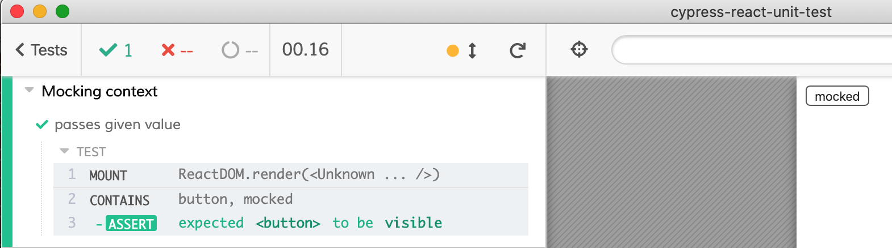

# Mocking context around the component

- [App-spec.js](App-spec.js) tests [App.jsx](App.jsx) that has a context provider [context.js](context.js) around [Toolbar.jsx](Toolbar.jsx)

We can also create children elements with mock context around them right from the test file. See [Mock-context-spec.js](Mock-context-spec.js) file.

```js
import { mount } from 'cypress-react-unit-test'
import { ThemeContext } from './context'
import { Toolbar } from './Toolbar.jsx'

it('passes given value', () => {
  mount(
    <ThemeContext.Provider value="mocked">
      <Toolbar />
    </ThemeContext.Provider>,
  )
  // confirm "mocked" value is passed to the Toolbar
})
```



For more complex context mock example, see [bahmutov/sudoku](https://github.com/bahmutov/sudoku) repository.
