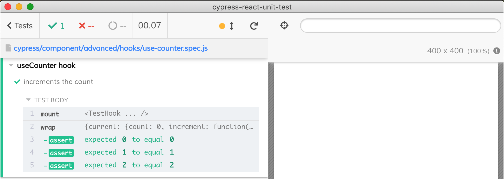

# testing React hooks

- [counter-with-hooks.spec.js](counter-with-hooks.spec.js) and [counter2-with-hooks.spec.js](counter2-with-hooks.spec.js) test React components that uses hooks
- [use-counter.spec.js](use-counter.spec.js) shows how to test a React hook using `mountHook` function

Note: hooks are mounted inside a test component following the approach shown in [react-hooks-testing-library](https://github.com/testing-library/react-hooks-testing-library/blob/master/src/pure.js)
