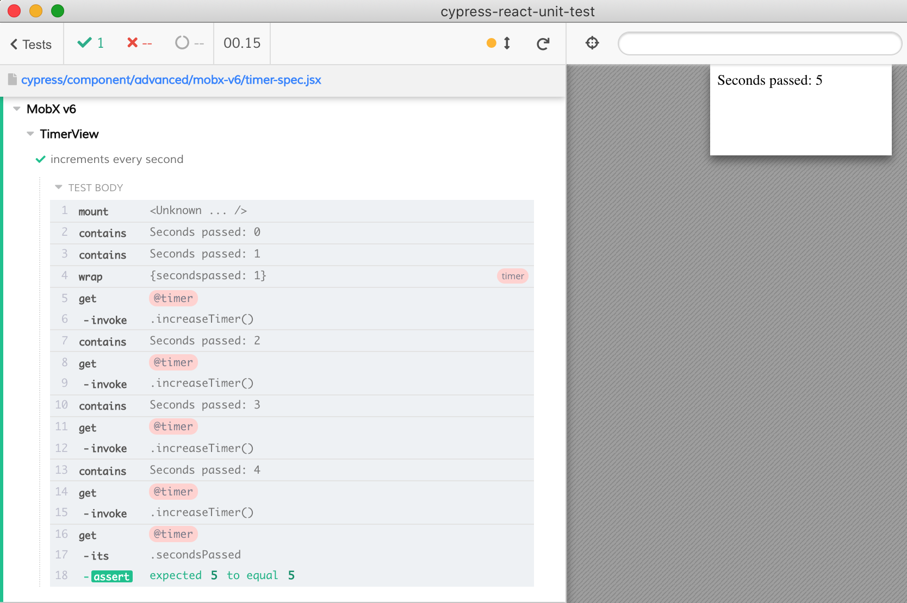

# MobX v6 example

Based on the example from [the docs](https://mobx.js.org/react-integration.html)

See [Timer.js](Timer.js) that has an observable class, [timer-view.jsx](timer-view.jsx) for React component linked to a timer instance, and [timer-spec.jsx](timer-spec.jsx) showing a component test.

