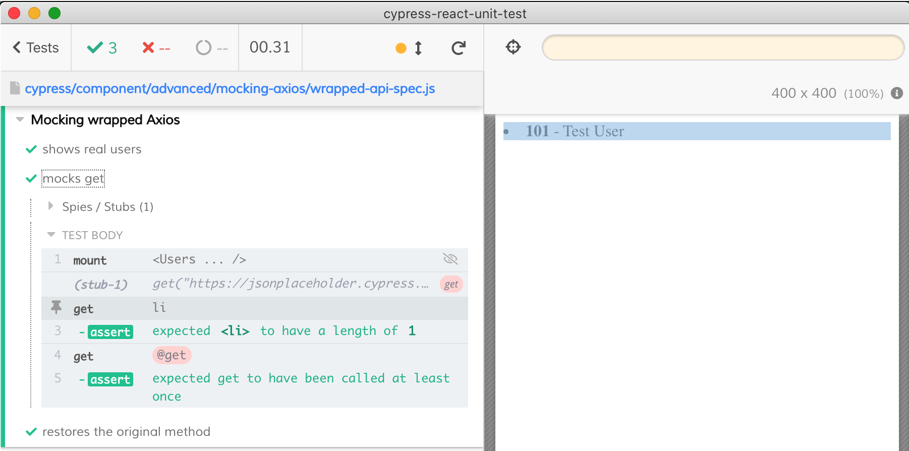

# Mocking CommonJS modules

Imagine your component is importing a CommonJS module from `node_modules` that you want to mock from the test. You can mock the methods by `require` that module and mocking its methods using [cy.stub](https://on.cypress.io/stub)

## When importing the entire module

Mock its methods from the test by using `require`

```js
// component code
import axios from 'axios'
axios.get('...')
// spec code, important to use `require` ⚠️
const Axios = require('axios')
cy.stub(Axios, 'get')
```

See [1-users.jsx](./1-users.jsx) and [1-users.spec.js](./1-users.spec.js) files.

## When importing a named export

Mock this method from the test by using `require`

```js
// component code only imports "get" from the module
import { get } from 'axios'
get('...')
// spec code, important to use `require` ⚠️
const Axios = require('axios')
cy.stub(Axios, 'get')
```

See [2-users-named.jsx](./2-users-named.jsx) and [2-users-named.spec.js](./2-users-named.spec.js) files.

## Using wrapper module

Mock any methods using `import` from the spec file.

You can also wrap module from `node_modules` and mock the wrap, and in this case the spec file can use `import` statements

```js
// wrapper code
export * from 'axios'
// component code
// import wrapped Axios method
import { get } from './axios-api'
// spec code can use "import"
import * as Axios from './axios-api'
```



See [3-users-api.jsx](./3-users-api.jsx) and [3-users-api.spec.js](./3-users-api.spec.js) files.
