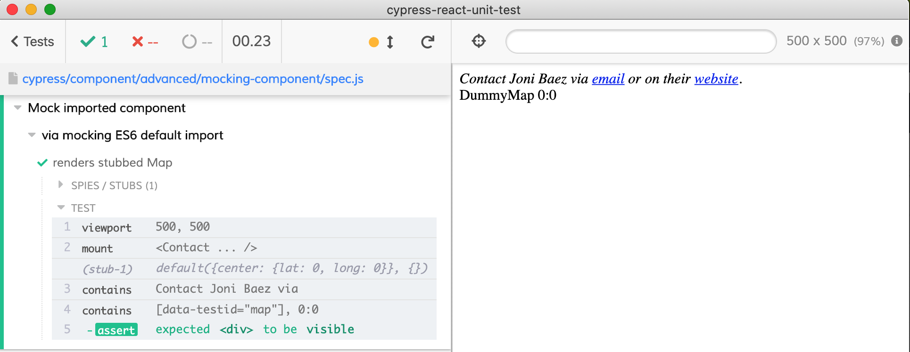

# Mocking ES6 imports

The original example comes from https://reactjs.org/docs/testing-recipes.html#mocking-modules

The [contact.js](contact.js) component imports [map.js](map.js) component. But the real Map is expensive to render - it uses Google Maps, etc. Thus during tests we would like to replace the real Map with `DummyMap` component that only renders the props.

See [spec.js](spec.js) test file. The recommended approach is to mock the ES6 import.

```js
// contact.js
import Map from './map'
export default function Contact(props) {
  // renders <Map ...>
}

// spec.js
import Contact from './contact'
import * as MapModule from './map'

const DummyMap = props => (
  <div data-testid="map">
    DummyMap {props.center.lat}:{props.center.long}
  </div>
)

it('renders stubbed Map', () => {
  // DummyMap component will be called with props and any other arguments
  cy.stub(MapModule, 'default').callsFake(DummyMap)

  cy.viewport(500, 500)
  const center = { lat: 0, long: 0 }
  mount(
    <Contact
      name="Joni Baez"
      email="test@example.com"
      site="http://test.com"
      center={center}
    />,
  )

  cy.contains('Contact Joni Baez via')
  // confirm DummyMap renders "0:0" passed via props
  cy.contains('[data-testid="map"]', '0:0').should('be.visible')
})
```


