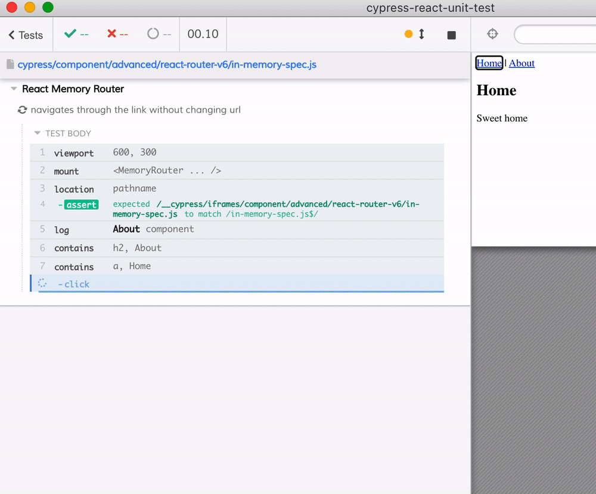

# React Router v6

We are testing the navigation in the [app.jsx](app.jsx) when it is surrounded by a React Router from [react-router-dom](https://github.com/ReactTraining/react-router#readme)

- [spec.js](spec.js) uses `BrowserRouter`
- [in-memory-spec.js](in-memory-spec.js) uses `MemoryRouter`

