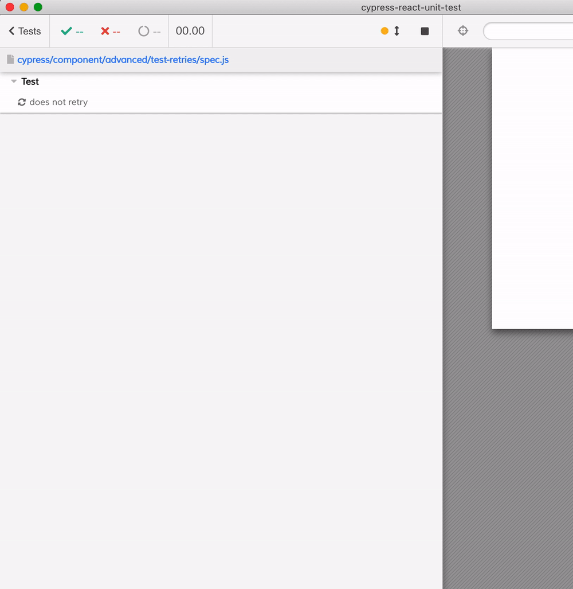

# test retries

This plugin is compatible with Cypress [Test Retries](https://github.com/cypress-io/cypress/pull/3968). For example in [spec.js](spec.js) we fail the test on purpose until the desired UI happens

```js
const Hello = () => {
  // this is how you can get the current retry number
  // attempt 1: (first test execution) retry = 0
  // attempt 2: (second test execution) retry = 1
  // attempt 3: retry = 2,
  // etc
  const n = cy.state('test').currentRetry ? cy.state('test').currentRetry() : 0
  return <div>retry {n}</div>
}
it('retries', { retries: 3 }, () => {
  mount(<Hello />)
  // now let's fail the test - it will retry several times and pass
  cy.contains('retry 3', { timeout: 1500 })
})
```


