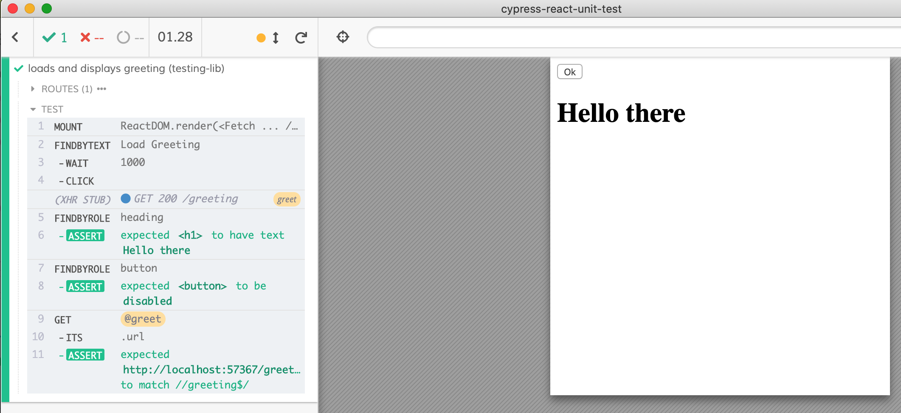

# Using @testing-library/cypress

You can install and bring [Testing library/Cypress](https://testing-library.com/docs/react-testing-library/example-intro) to be used in these React component tests. The following example was copied from [react-testing-library/example-intro](https://testing-library.com/docs/react-testing-library/example-intro). Read [Test The Interface Not The Implementation](https://glebbahmutov.com/blog/test-the-interface/).

- [fetcher.js](fetcher.js) is the component we are testing
- [testing-lib-spec.js](testing-lib-spec.js) is component test implemented using `Testing library/Cypress`

```js
it('loads and displays greeting (testing-lib)', () => {
  cy.server()
  cy.route('/greeting', { greeting: 'Hello there' }).as('greet')

  const url = '/greeting'
  mount(<Fetch url={url} />)

  cy.findByText('Load Greeting')
    .wait(1000)
    .click()
  cy.findByRole('heading').should('have.text', 'Hello there')
  cy.findByRole('button').should('be.disabled')
  cy.get('@greet')
    .its('url')
    .should('match', /\/greeting$/)
})
```



- [spec.js](spec.js) is an equivalent example test using "plain" Cypress commands.
