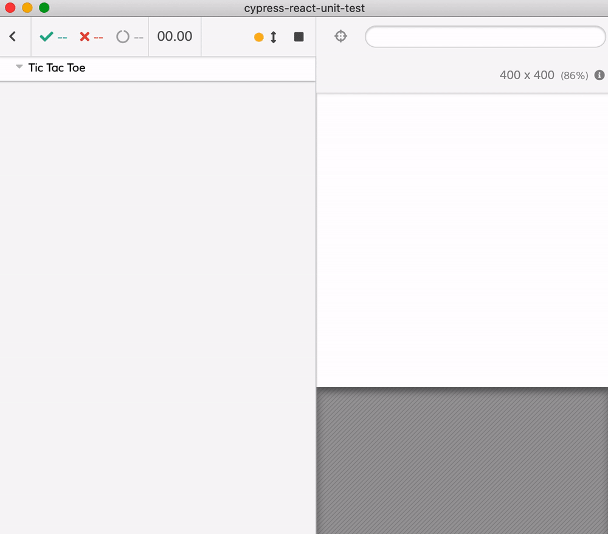

React tutorial from https://reactjs.org/tutorial/tutorial.html

Just following the tutorial and writing Cypress component tests.

## Tic-tac-toe

<!-- markdown-link-check-disable -->

The example code taken from [https://codepen.io/gaearon/pen/LyyXgK](https://codepen.io/gaearon/pen/LyyXgK)

<!-- markdown-link-check-enable -->

<!-- prettier-ignore-start -->
Test | Description
--- | ---
[square-spec.js](square-spec.js) | Testing individual square
[tic-tac-toe-spec.js](tic-tac-toe-spec.js) | Testing the entire game
<!-- prettier-ignore-end -->

For larger Tic-Tac-Toe example with mocking, read the blog post [Tic-Tac-Toe Component Tests](https://glebbahmutov.com/blog/tic-tac-toe-component-tests/)
