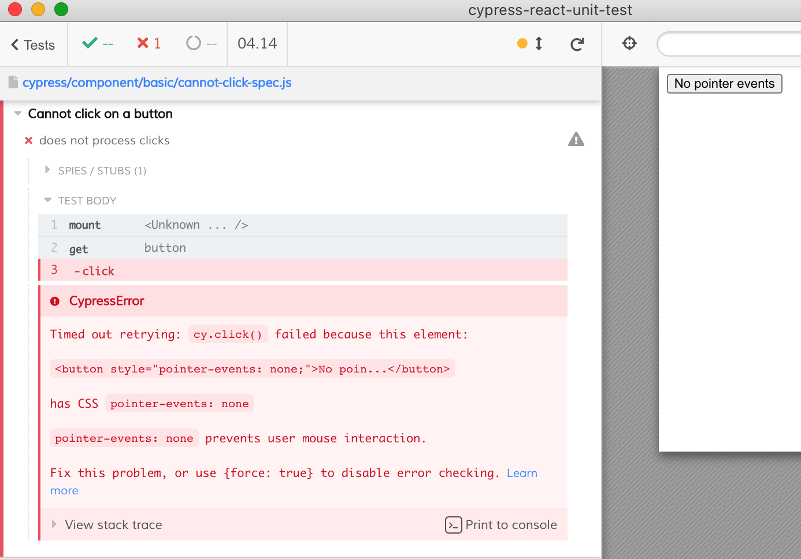

# fails correctly

A small demo that shows that Cypress respects `pointerEvents: 'none'` element style because the test runs in a real browser, unlike [Jest + JSDom demo](https://codesandbox.io/s/react-testing-library-demo-forked-z7l2o?file=/src/__tests__/components.js)

Trying to click fails the test

Another test shows that Cypress does not type into a read-only input element.
