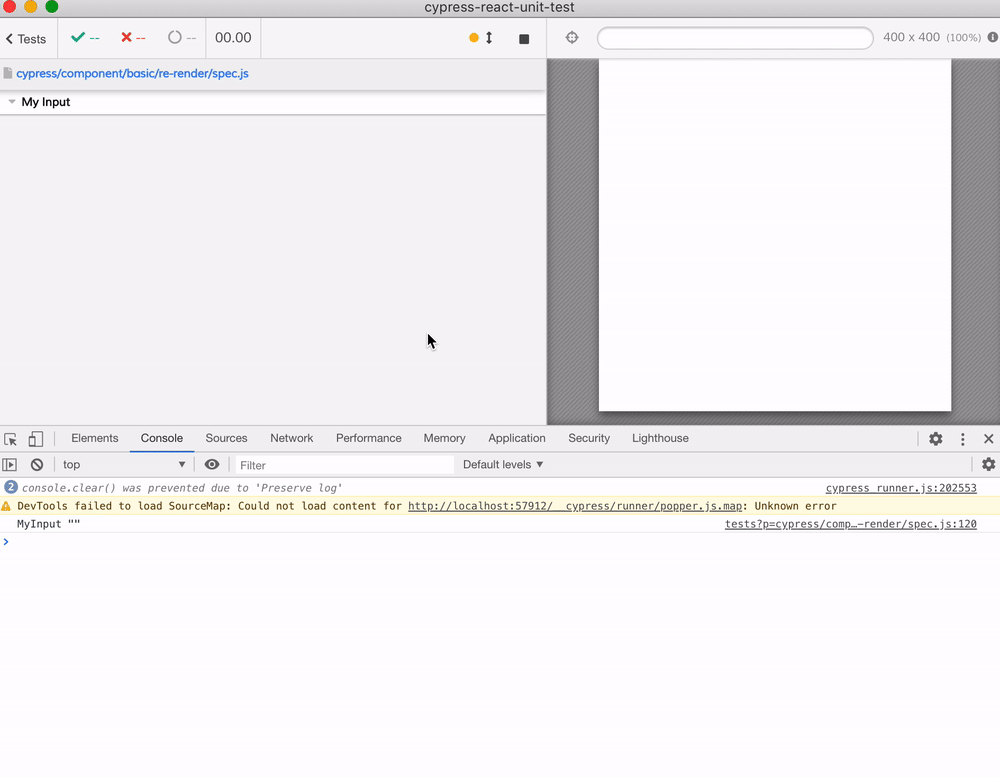

# re-render

If you want to see how a component re-renders in reaction to changed props, you have to make a mini-web app around it. See [spec.js](spec.js) but in essence you never keep the component, but create a new one.

