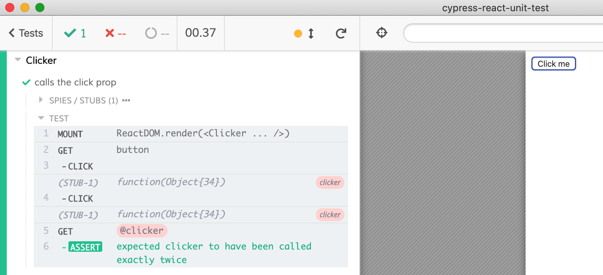

# Stub examples

You can pass a [cy.stub](https://on.cypress.io/stub) as a property to the mounted component and then assert it was invoked.

```js
it('calls the click prop', () => {
  const onClick = cy.stub().as('clicker')
  mount(<Clicker click={onClick} />)
  cy.get('button')
    .click()
    .click()
  cy.get('@clicker').should('have.been.calledTwice')
})
```



## Tests

- [clicker-spec.js](clicker-spec.js) passes a stub to the component and asserts it was called
- [clicker-with-delay-spec.js](clicker-with-delay-spec.js) passes a stub to the component that is called on click, but only after a delay. Shows the difference between [.then](https://on.cypress.io/then) and [.should](https://on.cypress.io/should). Shows my favorite method of querying stubs via an alias

```js
const onClick = cy.stub().as('clicker')
mount(<Clicker click={onClick} />)
...
cy.get('@clicker').should('have.been.calledTwice')
```

## More info

Watch [Assert that the stub was called twice](https://youtu.be/AlltFcsIFvc) showing these specs.

Read [Stubs, spies and clocks](https://on.cypress.io/stubs-spies-and-clocks) and [Retry-ability](https://on.cypress.io/retry-ability).
