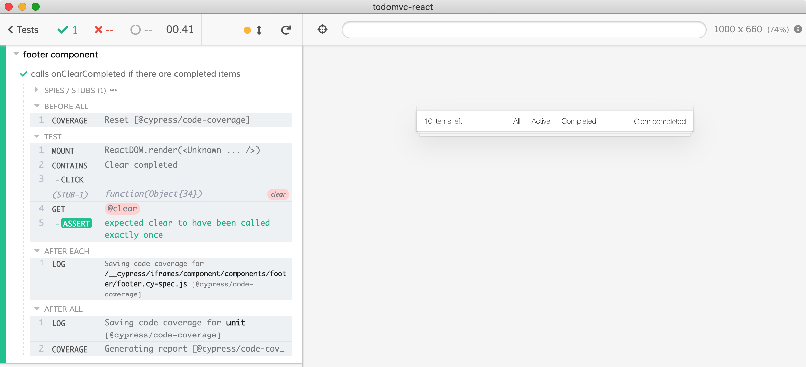

# styles

If you component imports its own style, the style should be applied during the Cypress test.

```js
// Footer.jsx
import React from 'react'
import './main.css' // <== style import
export default Footer = () => ...

// Footer.spec.js
import React from 'react'
import Footer from './Footer.jsx'
import { mount } from 'cypress-react-unit-test'

it('is stylish', () => {
  mount(<Footer />)
  // styles are there because the component has imported them
  // and the bundler handled it for us
})
```

## Import from spec

Sometimes the root component imports the style, or it is included from `src/public/index.html` file. We can usually import the style directly from the spec file:

```js
// Footer.jsx
import React from 'react'
export default Footer = () => ...

// Footer.spec.js
import React from 'react'
import { mount } from 'cypress-react-unit-test'
import Footer from './Footer.jsx'
import './main.css' // <== style import

it('is stylish', () => {
  mount(<Footer />)
  // styles are there because the spec has imported the CSS file
})
```

### Additional markup

The global style might assume a certain DOM structure. You can "mimic" this structure by surrounding the component with additional elements with necessary styles. For example, this is the Footer component from [bahmutov/todomvc-react](https://github.com/bahmutov/todomvc-react) repository:

```css
.todoapp {
  ...;
}

.footer {
  ...;
}
```

```js
import React from 'react'
import { mount } from 'cypress-react-unit-test'
import { Footer } from './footer'
// import app's style so the footer looks real
import 'todomvc-app-css/index.css'

describe('footer component', () => {
  it('calls onClearCompleted if there are completed items', () => {
    // to make the app look just like
    // it would in a real application
    // add a section with class "todoapp" around the footer
    mount(
      <section className="todoapp">
        <Footer
          itemsLeft={10}
          completedCount={2}
          onClearCompleted={cy.stub().as('clear')}
        />
      </section>,
    )
    // component is running like a mini web app
    // we can interact with it using normal Cypress commands
    // https://on.cypress.io/api
    cy.contains('Clear completed').click()
    cy.get('@clear').should('have.been.calledOnce')
  })
})
```

The component looks nice:



## Extra styles

But sometimes you need more power.

You can use one or all 3 options to load additional styles:

```js
mount(<Component />, {
  style: string, // load inline style CSS
  cssFiles: string | string[], // load a single or a list of local CSS files
  stylesheets: string | string[] // load external stylesheets
})
```

### Inline styles

You can add individual style to the mounted component by passing its text as an option

```js
it('can be passed as an option', () => {
  const style = `
    .component-button {
      display: inline-flex;
      width: 25%;
      flex: 1 0 auto;
    }

    .component-button.orange button {
      background-color: #F5923E;
      color: white;
    }
  `
  cy.mount(<Button name="Orange" orange />, { style })
  cy.get('.orange button').should(
    'have.css',
    'background-color',
    'rgb(245, 146, 62)',
  )
})
```

### Load local CSS file

```js
const cssFiles = 'cypress/integration/Button.css'
cy.mount(<Button name="Orange" orange />, { cssFiles })
```

See [cypress/integration/inject-style-spec.js](cypress/integration/inject-style-spec.js) for more examples.

### Load external stylesheets

```js
mount(<Todo todo={todo} />, {
  stylesheets: [
    'https://cdnjs.cloudflare.com/ajax/libs/bulma/0.7.2/css/bulma.css',
  ],
})
```
