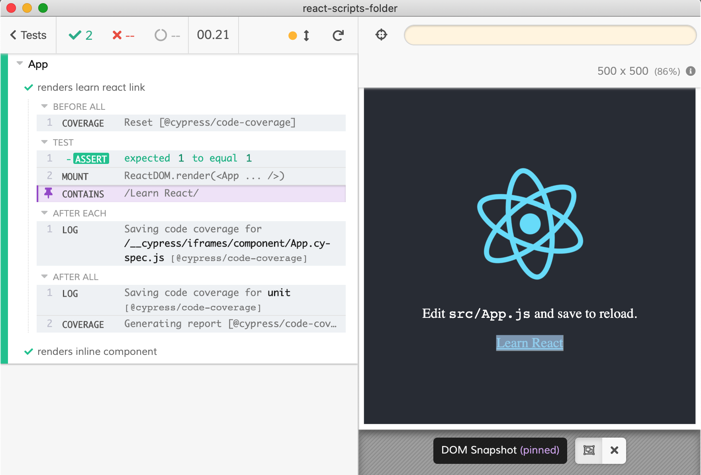

# example: react-scripts-folder

> A typical project using `react-scripts` with components in the [src](src) folder and component tests inside [cypress/component](cypress/component) folder.

Cypress automatically finds Webpack settings used by `react-scripts` and inserts the component folder name allowing to transpile the component specs the same way the `src` code is transpiled.



## Usage

1. Make sure the root project has been built .

```bash
# in the root of the project
npm install
npm run build
```

2. Run `npm install` in this folder to symlink the `cypress-react-unit-test` dependency.

```bash
# in this folder
npm install
```

3. Start Cypress

```bash
npm run cy:open
# or just run headless tests
npm test
```
