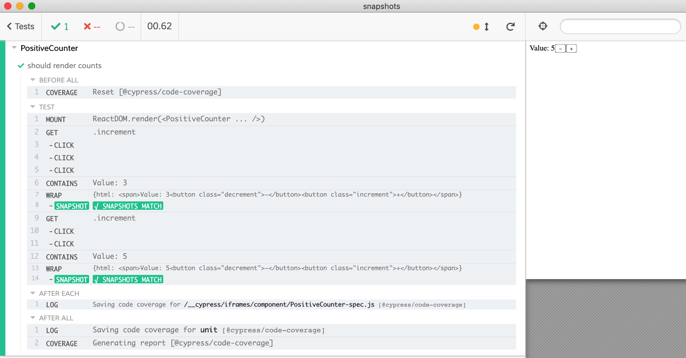
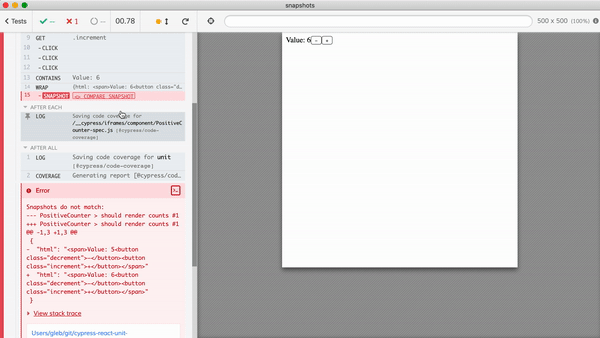

# example: react-snapshots

> Component testing with snapshots using [cypress-plugin-snapshots](https://github.com/meinaart/cypress-plugin-snapshots)

Example component taken from [Snapshot Testing React Components with Jest](https://semaphoreci.com/community/tutorials/snapshot-testing-react-components-with-jest)



See [cypress/component/PositiveCounter-spec.js](cypress/component/PositiveCounter-spec.js) and saved snapshots in [cypress/component/**snapshots**/](cypress/component/__snapshots__/PositiveCounter-spec.js.snap).

## Usage

1. Make sure the root project has been built .

```bash
# in the root of the project
npm install
npm run build
```

2. Run `npm install` in this folder to symlink the `cypress-react-unit-test` dependency.

```bash
# in this folder
npm install
```

3. Start Cypress

```bash
npm run cy:open
# or just run headless tests
npm test
```

## Failing tests

If the snapshot contents does not match the saved snapshot file, the test fails. You can click on the snapshot command, review the difference, and if the difference is expected, update the snapshot from the Test Runner's GUI.



## More info

You can use other snapshot plugins from [the plugins list](https://on.cypress.io/plugins)
