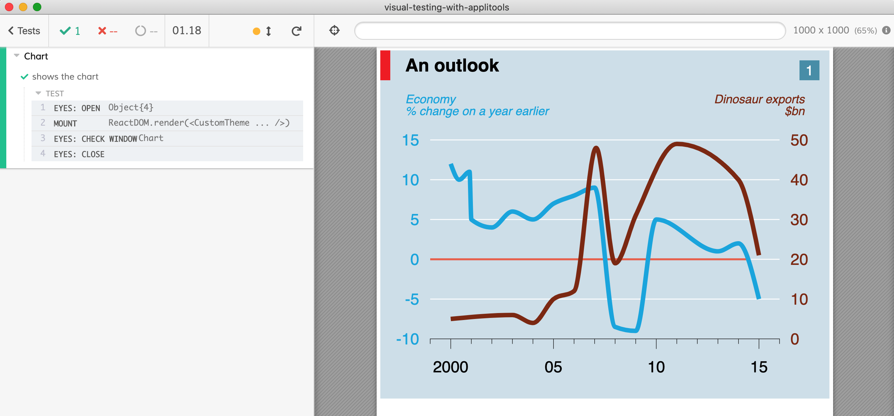
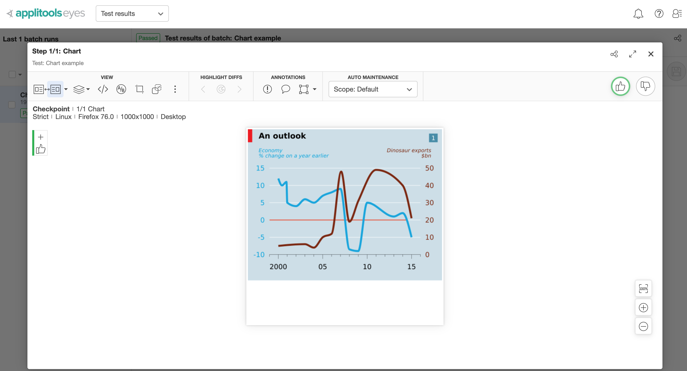
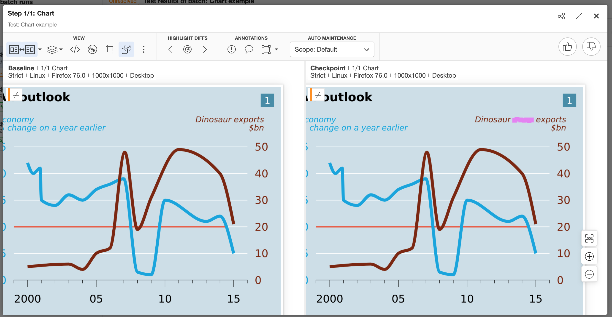

# example: visual testing using Applitools

> An example using Applitools to visually check React charts made with the [Victory](https://formidable.com/open-source/victory/) library.



See [src/Chart.spec.js](src/Chart.spec.js)

## Usage

1. Make sure the root project has been built .

```bash
# in the root of the project
npm install
npm run build
```

2. Run `npm install` in this folder to symlink the `cypress-react-unit-test` dependency.

```bash
# in this folder
npm install
```

3. Start Cypress

```bash
npm run cy:open
# or just run headless tests
npm test
```

## Notes

The `cy.eyes*` commands are ignored during local interactive run. On CI, the `cy.eyes*` send the snapshots to Applitools servers to be analyzed and compared against the baseline images.



For more information, see [Applitools tutorial](https://applitools.com/tutorials/cypress.html).

If there is a difference in visual output, Applitools catches it and fails the test run. The [Applitools Dashboard](https://applitools.com/) then allows you to review the changes, determine the root cause for the change, and maybe approve the visual changes to update the baseline images.


