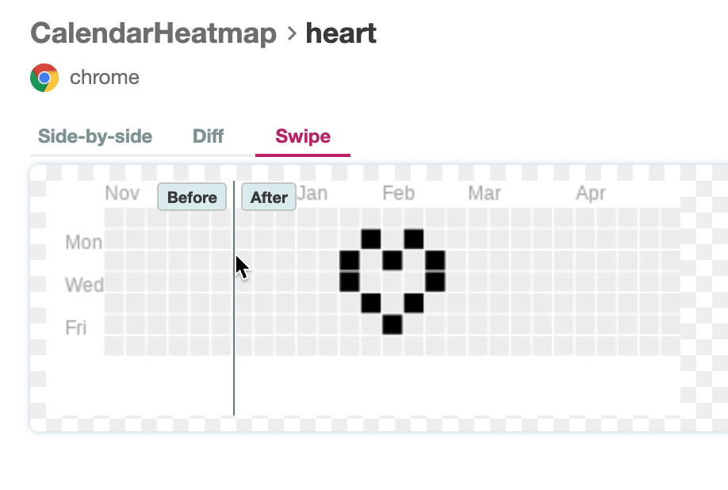

<!-- markdown-link-check-disable -->

# example: visual-testing-with-happo [Happo Dashboard](https://happo.io/a/340/dashboard)

<!-- markdown-link-check-enable -->

> Visual component testing using [Happo.io](https://docs.happo.io/docs/cypress)

## Usage

1. Make sure the root project has been built .

```bash
# in the root of the project
npm install
npm run build
```

2. Run `npm install` in this folder to symlink the `cypress-react-unit-test` dependency.

```bash
# in this folder
npm install
```

3. Start Cypress

```bash
npm run cy:open
# or just run headless tests
npm test
```

## Notes

Here's an example PR with code a change where we forgot to update the styles with additional classes: [#210](https://github.com/bahmutov/cypress-react-unit-test/pull/210)

Notice that CircleCI passes the test, because functionally it worked, but the Happo CI check shows a failure:


Happo report shows 3 views:

### Side by side


### Diff


### Swipe


