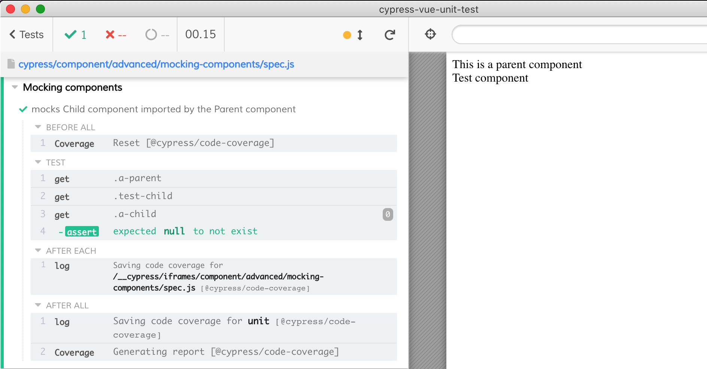

# mocking components

Sometimes you want to replace a complicated component with a mock component during tests. Assuming each component does local registration, you should be able to replace the registered component from tests.

See [spec.js](spec.js)

