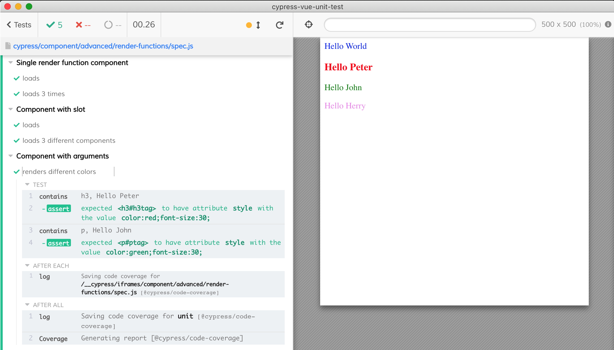

# render functions

Based on examples from [Vue.js Render Functions](https://www.tutorialandexample.com/vue-js-render-functions/) tutorial.

See [spec.js](spec.js) for examples of mounting a component, using multiple components, passing props data.

