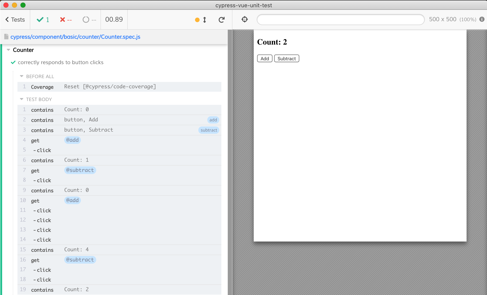
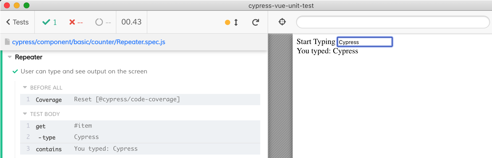
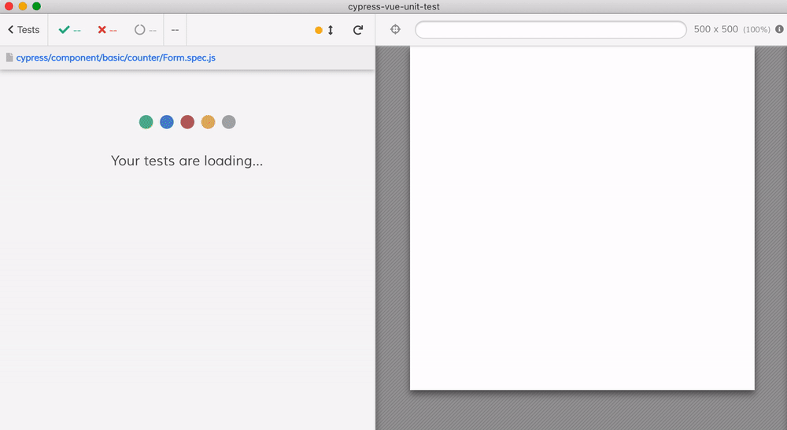

# Small examples

These examples come from the blog post [Testing Vue components with Vue Testing Library](https://blog.logrocket.com/testing-vue-components-with-vue-testing-library/) and the tests are written using `@cypress/vue`.

Tests for [Counter.vue](Counter.vue) are in [Counter.spec.js](Counter.spec.js)

Tests for [Repeater.vue](Repeater.vue) are in [Repeater.spec.js](Repeater.spec.js)

Tests for [Form.vue](Form.vue) are in [Form.spec.js](Form.spec.js)

Tests for [AppInput.vue](AppInput.vue) in [AppInput.spec.js](AppInput.spec.js) show how to pass a `slot` template to a component while mounting it.
