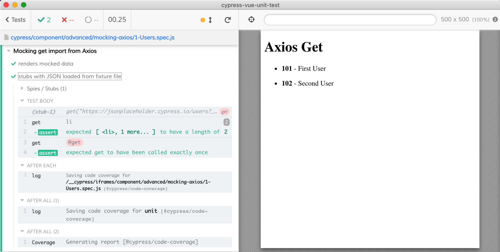
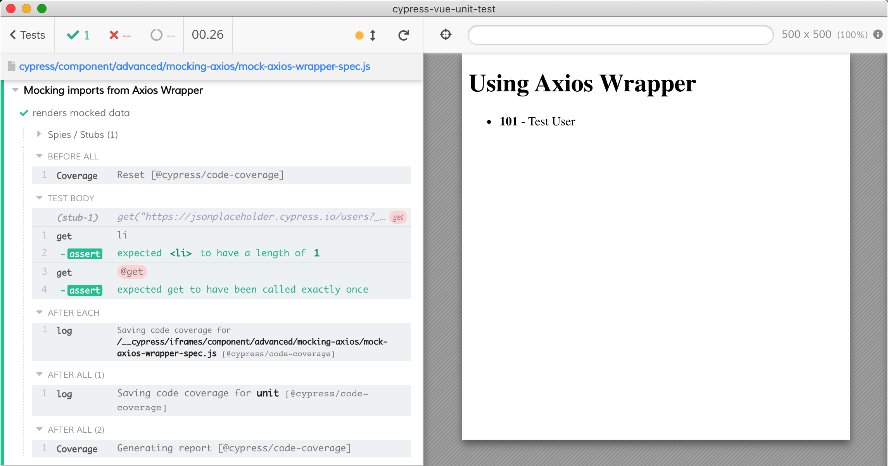

# Mocking axios

Axios is a 3rd party CommonJS module installed in `node_modules` and used from Vue components. To mock such module you have 3 choices, depending on how it is used.

## Named import

If the component imports a single named property from a CommonJS module, the spec file can require the entire module and stub a property using [cy.stub](https://on.cypress.io/stub) command.

```js
// component code
import { get } from 'axios'
get('...').then(...)

// spec file uses "require" to load the CommonJS module
const Axios = require('axios')
cy.stub(Axios, 'get').resolves({
  data: [
    {
      id: 101,
      name: 'Test User',
    },
  ],
})
```



See [1-Users.vue](1-Users.vue) and [1-Users.spec.js](1-Users.spec.js) files.

## Method

If the component imports the entire CommonJS module, then calls its method, you still require the same module from the spec file.

```js
// component code
import axios from 'axios'
axios.get('...').then(...)

// spec file uses "require" to load the CommonJS module
const Axios = require('axios')
cy.stub(Axios, 'get').resolves({
  data: [
    {
      id: 101,
      name: 'Test User',
    },
  ],
})
```

See [1-Users.vue](1-Users.vue) and [1-Users.spec.js](1-Users.spec.js) files.

## Wrapped module

Sometimes the component code uses an intermediate ES6 wrapper module, like [AxiosApi.js](AxiosApi.js) that re-experts the CommonJS module; you can then mock those exports.

```js
// AxiosApi.js
export * from 'axios'
```

[3-Users.vue](3-Users.vue) shows the component that imports from `AxiosApi.js`

```js
import { get } from './AxiosApi'
```

The test [3-Users.spec.js](3-Users.spec.js) mocks the "get" import.

```js
import Users from './Users.vue'
import * as AxiosApi from './AxiosApi'

cy.stub(AxiosApi, 'get')
  .resolves({
    data: [
      {
        id: 101,
        name: 'Test User',
      },
    ],
  })
  .as('get')

mount(Users)
```


