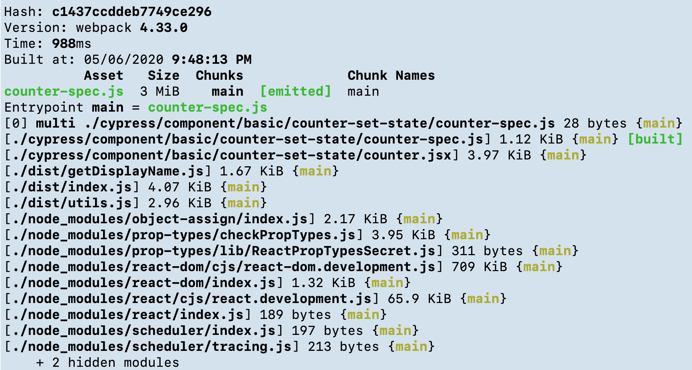

# Cypress Webpack Preprocessor

Cypress preprocessor for bundling JavaScript via webpack

## Installation

```sh
npm install --save-dev @cypress/webpack-preprocessor
```

This package relies on the following [peer dependencies](https://docs.npmjs.com/files/package.json#peerdependencies):

* @babel/core
* @babel/preset-env
* babel-loader
* webpack

It is likely you already have these installed either directly or as a transient dependency, but if not, you will need to install them.

```sh
npm install --save-dev @babel/core @babel/preset-env babel-loader webpack
```

## Compatibility

This version is only compatible with webpack 4.x+ and Babel 7.x+.

* If you need webpack 2 or 3 support, use `@cypress/webpack-preprocessor` 1.x
* If you need Babel 6 support, use `@cypress/webpack-preprocessor` <= 2.x

By default, this plugin (and all Cypress plugins) run in the Node version that is bundled with Cypress. Alternatively, you can use the Node found on your system by setting [nodeVersion: system](https://on.cypress.io/configuration#Node-version) configuration option. A common use case for using the system Node are native dependencies like `node-sass`.

## Usage

In your project's [plugins file](https://on.cypress.io/guides/tooling/plugins-guide.html):

```javascript
const webpackPreprocessor = require('@cypress/webpack-preprocessor')

module.exports = (on) => {
  on('file:preprocessor', webpackPreprocessor())
}
```

## Examples

- [React app](https://github.com/cypress-io/cypress/tree/develop/npm/webpack-preprocessor/examples/react-app) shows how to point Cypress at Webpack configuration from `react-scripts` dependency
- [use-babelrc](https://github.com/cypress-io/cypress/tree/develop/npm/webpack-preprocessor/examples/use-babelrc) shows how to use your project's `.babelrc` with Webpack
- [use-ts-loader](https://github.com/cypress-io/cypress/tree/develop/npm/webpack-preprocessor/examples/use-ts-loader) shows how to transpile TypeScript specs following [Webpack TypeScript guide](https://webpack.js.org/guides/typescript/)

## Options

Pass in options as the second argument to `webpack`:

```javascript
const webpackPreprocessor = require('@cypress/webpack-preprocessor')

module.exports = (on) => {
  const options = {
    // send in the options from your webpack.config.js, so it works the same
    // as your app's code
    webpackOptions: require('../../webpack.config'),
    watchOptions: {},
  }

  on('file:preprocessor', webpackPreprocessor(options))
}
```

### webpackOptions

Object of webpack options. Just `require` in the options from your `webpack.config.js` to use the same options as your app.

**Default**:

```javascript
{
  mode: 'development',
  module: {
    rules: [
      {
        test: /\.jsx?$/,
        exclude: [/node_modules/],
        use: [{
          loader: 'babel-loader',
          options: {
            presets: ['@babel/preset-env'],
          },
        }],
      },
    ],
  },
}
```

Source maps are **always enabled** unless explicitly disabled by specifying `devtool: false`.

Webpack [mode](https://webpack.js.org/configuration/mode/) is set to `development` if not present. You can set `mode` to "development", "production" or "none".

### use babelrc

If you have a `.babelrc` file and would like to use it, then you must delete `options.presets` from the default Webpack options

```js
const webpackPreprocessor = require('@cypress/webpack-preprocessor')
const defaults = webpackPreprocessor.defaultOptions
module.exports = (on) => {
  delete defaults.webpackOptions.module.rules[0].use[0].options.presets
  on('file:preprocessor', webpackPreprocessor(defaults))
}
```

### watchOptions

Object of options for watching. See [webpack's docs](https://webpack.js.org/configuration/watch).

**Default**: `{}`

### additionalEntries

An array of file path strings for additional entries to be included in the bundle.

By necessity, this preprocessor sets the entry point for webpack as the spec file or support file. The `additionalEntries` option allows you to specify more entry points in order to utilize webpack's [multi-main entry](https://webpack.js.org/concepts/entry-points/#single-entry-shorthand-syntax). This allows runtime dependency resolution.

**Default**: `[]`

**Example**:

```javascript
const webpackPreprocessor = require('@cypress/webpack-preprocessor')

module.exports = (on) => {
  const options = {
    webpackOptions: require('../../webpack.config'),
    additionalEntries: ['./app/some-module.js'],
  }

  on('file:preprocessor', webpackPreprocessor(options))
}
```

## Modifying default options

The default options are provided as `webpack.defaultOptions` so they can be more easily modified.

If, for example, you want to update the options for the `babel-loader` to add the [stage-3 preset](https://babeljs.io/docs/plugins/preset-stage-3/), you could do the following:

```javascript
const webpackPreprocessor = require('@cypress/webpack-preprocessor')

module.exports = (on) => {
  const options = webpackPreprocessor.defaultOptions
  options.webpackOptions.module.rules[0].use[0].options.presets.push('babel-preset-stage-3')

  on('file:preprocessor', webpackPreprocessor(options))
}
```

## Debugging

You can see debug messages from this module by running with environment variable

```
DEBUG=cypress:webpack
```

You can see Webpack bundle diagnostic output (timings, chunks, sizes) by running with environment variable

```
DEBUG=cypress:webpack:stats
```


## Contributing

Use the [version of Node that matches Cypress](https://github.com/cypress-io/cypress/blob/develop/.node-version).

Build the typescript files:

```shell
yarn build
```

Watch the typescript files and rebuild on file change:

```shell
yarn build --watch
```

Run all tests once:

```shell
npm test
```

Run tests in watch mode:

```shell
npm run test-watch
```

## License

This project is licensed under the terms of the [MIT license](/LICENSE.md).

[semantic-image]: https://img.shields.io/badge/%20%20%F0%9F%93%A6%F0%9F%9A%80-semantic--release-e10079.svg
[semantic-url]: https://github.com/semantic-release/semantic-release

## Changelog

[Changelog](./CHANGELOG.md)
