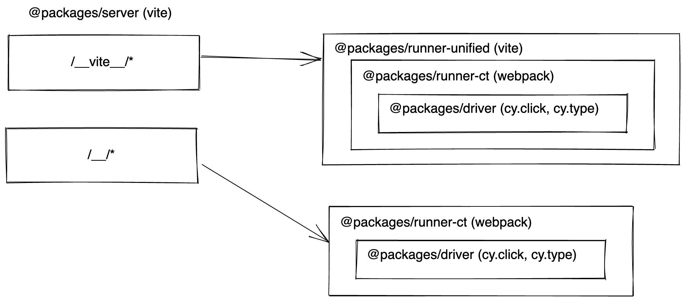

## App

This is the front-end for the Cypress App.

## Development

1. `yarn dev` (inside of `packages/app`)
2. It will open launchpad
3. Select Component or E2E Testing
3. Open chrome (or another browser)
4. It will show the new Vite powered app 

## How it works

Cypress has two modes: `run` and `open`. We want run mode to be as light and fast as possible, since this is the mode used to run on CI machines, etc. Open mode is the interactive experience, with the command log, snapshots, selector playground, etc.

- **`open`** mode is driven using GraphQL and urql. It shows the full Cypress app, include the top nav, side nav, spec list, etc. You can change between testing types, check your latest runs on the Cypress dashboard, updating settings, etc.
- **`run`** mode is does not rely on GraphQL. This is so we can be as performant as possible. It only renders the "runner" part of the UI, which is comprised of the command log and AUT iframe.

The two modes are composed using the same logic, but have slightly different components. You can see where the differences are in `Runner.vue`(src/pages/Specs/Runner.vue). Notice that `<SpecRunnerOpenMode>` receives a `gql` prop, since it uses GraphQL, and `<SpecRunnerRunMode>` does not.

## Using existing, Vite-incompatible modules

Some of our modules, like `@packages/reporter`, `@packages/driver` and `@packages/runner-shared` cannot be easily
used with Vite due to circular dependencies and modules that do not have compatible ESM builds.

To work around this, when consuming existing code, it is bundled with webpack and made available under the
`window.UnifiedRunner` namespace. It is injected via [`injectBundle`](./src/runner/injectBundle.ts).

To add more code to the bundle, add it in the bundle root, `@packages/runner-ct/src/main.tsx` and attach it to
`window.UnifiedRunner`.

As a rule of thumb, avoid importing from the older, webpack based modules into this package. Instead, if you want to consume code from those older, webpack bundled modules, you should add them to the webpack root and consume them via `window.UnifiedRunner`. Ideally, update [`index.d.ts`](./index.d.ts) to add the types, as well.

### Icons

The icons will temporarily live in this package and will soon be moved to `packages/frontend-shared`.

## Cy's New Icon Library
Cy has a very custom icon library.
* Most of our icons are duo-tone
* They must be styled in both dark and light contexts (e.g. on a dark menu bar vs on a light background).
* Since they're duotone, you want to target the specific strokes and fills of the SVGs to color them.
* All of the niceties of our utility classes should work (e.g. `group-hover` or `group-focus`).

### Usage
#### Importing Icons
1. `import MyIcon from '~icons/cy/path-to-icon_x16'`
2. Automatic template discovery
```jsx
/* This just works. No imports necessary */
<i-cy-path-to-icon_x16 />
```

#### Styling Icons
```jsx
/* This renders a book icon from `./src/assets/book_x16.svg`
 * and makes it pink and purple
 */

<i-cy-book_x16 class="
  hover:icon-dark-pink-500
  hover:icon-light-purple-300
  icon-dark-pink-300
  icon-dark-purple-50
" />
```

### Implementation: Custom classes w/ a WindiCSS plugin
To support selecting specific paths while keeping tailwind's incredibly helpful interaction helpers (e.g. `group-hover` or `group-focus`), I made a WindiCSS plugin.

I also moved the Windi config into a `.windicss` directory at the root of the App directory.

#### Rules of Icons
For an icon to work well in the current system, here's what needs to happen when we import it:

1. Icon paths must define themselves as "icon-dark" or "icon-light" in their class names.
If an icon path doesn't define a class, nothing bad will happen, it just won't get targeted by any styling.

2. Finally, you don't need to expose anything. `./src/assets/icons` is automatically watched and loaded 😮

## Diagram

]

