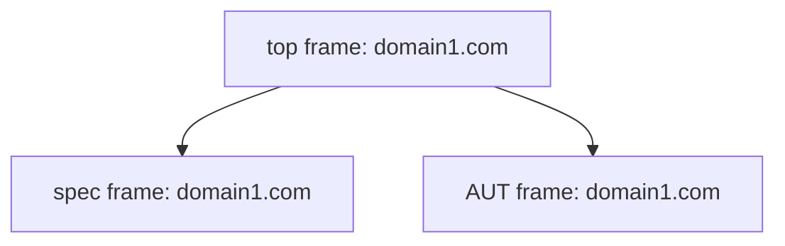
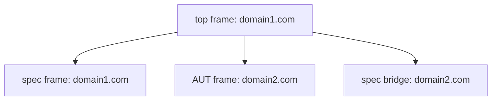

# Cross-origin Testing Technical Overview

The goal of this document is to give a technical overview of the architecture behind the **cy.origin()** command, which enables cross-origin testing in Cypress.

## Definitions

See [Node.js’s URL doc](https://nodejs.org/api/url.html#url-strings-and-url-objects) for a handy breakdown of URL parts

- **domain**: The hostname portion of a URL. (e.g. `example.com`, `www.example.com`, `www.example.co.uk`, `localhost`)
- **superdomain**: A domain without the subdomain. (e.g. `example.com`, `example.co.uk`, `localhost`)
- **origin**: The combination of the protocol, hostname, and port of a URL (e.g. `http://www.example.com:3500`)
- **top**: The main window/frame of the browser
- **primary origin**: The origin that top is on
- **secondary origin**: Any origin that is not the primary origin
- **primary driver**: The Cypress driver that run in **top** on the primary origin
- **secondary driver**: Any Cypress driver that run in a **spec bridge**, interacting with a secondary origin
- **AUT**: **A**pp **U**nder **T**est - the user's app currently being tested
- **AUT frame**: The iframe used to run the user's app
- **spec frame**: The iframe used to run the spec file

## Frame architecture (single origin)

When testing a single origin, all 3 frames are loaded on that origin.

Components:



**top** communicates directly and synchronously with the **spec frame** and the **AUT frame**. The **spec frame** runs the spec, which uses the driver to run commands and interact with the **AUT**.

In a single test (`it` + hooks), the **AUT** must remain on the same origin or a cross-origin error will occur, as **top** can no longer interact with the **AUT** in that circumstance. Different tests can visit different origins. In this case, we change **top** to the new origin, which also runs the **spec frame** on that origin. This navigation causes the spec to run again. We skip any already-run tests and resume.

## Frame architecture (multiple origins)

Let’s say the primary origin is `domain1.com` and the secondary origin is `domain2.com`. The test has visited `domain1.com` and then issued a click that caused the **AUT** to navigate to `domain2.com`.

Since the **AUT** is no longer on the same origin as **top**, they can no longer communicate synchronously. In order to facilitate cross-origin testing, we create another iframe we call the **spec bridge**. It exists as a sibling to the **AUT** (meaning they share the same parent frame, not to be confused with a DOM sibling). It contains a version of the driver tailored to cross-origin testing, with a different entry-point to the primary driver, but containing mostly the same code.

The **spec bridge** is run on `domain2.com` to match the **AUT**. This and being a sibling allows the spec bridge to communicate directly with the **AUT**. The **spec bridge** communicates *asynchronously* with **top** via the [postMessage API](https://developer.mozilla.org/en-US/docs/Web/API/Window/postMessage).

The **spec bridge** remains in the DOM from the moment it’s created until the browser is refreshed or closed, the same as the the **spec frame** and **AUT frame**.

Here’s what the components look like now:



## cy.origin()

Refer to the [public documentation on cy.origin()](https://on.cypress.io/origin) for all details on the user-facing API.

The main responsibilities of **cy.origin()** are to create the **spec bridge** for the specified origin and facilitate communication between the primary driver and the secondary driver in that **spec bridge**.

The callback function the user passes to **cy.origin()** is stringified by the **primary driver**, sent to the origin-matching **secondary driver** via postMessage, then evaluated. Its commands are run by the **secondary driver**, since it can communicate synchronously with the cross-origin **AUT**.

## Cross-origin communication

Communication between the **primary driver** and any **secondary drivers** occurs through the [postMessage API](https://developer.mozilla.org/en-US/docs/Web/API/Window/postMessage).  We abstract over the postMessage API with **cross-origin communicators**.

A **PrimaryOriginCommunicator** instance exists in the **primary driver** which receives messages from any **secondary drivers** and can send messages to either a single **secondary driver** for a particular origin or to all **secondary drivers** that currently exist.

Each **secondary driver** has a **SpecBridgeCommunicator** instance that can receive from and send messages to the **primary driver**.

One of the main responsibilities of the communicators is to prepare/preprocess data for serialization. All data going over the postMessage API gets serialized by the [structured clone algorithm](https://developer.mozilla.org/en-US/docs/Web/API/Web_Workers_API/Structured_clone_algorithm). In order to either prevent or catch serialization errors and ensure all relevant data is properly transmitted, we preprocess data such as the subject, logs, snapshots, and errors themselves.

For more information, please see the [Cross-origin Serialization Explainer](./src/util/serialization/README.md)

## Automation / Proxy

Browser automation APIs and the proxy play a small but critical role in facilitating cross-origin testing.

The proxy intercepts http requests from all sources. In order to detect cross-origin navigation of **AUT**, it’s necessary to know that a request came specifically from the **AUT frame** and not **top**, a nested iframe, or elsewhere. To achieve this, we use the browser automation APIs to add a `X-Cypress-Is-AUT-Frame` header to any requests from the AUT.

Allowing the proxy to know if a request is from the **AUT** enables us to recognize that it’s not the **primary origin** and inject code into the request that’s tailored to cross-origin testing.

### Cross-origin navigation timing

It’s possible for the user’s test to navigate to a different origin in a couple different ways.

#### Action-triggered navigation

An action causes the navigation (click, submit, etc).

If a user wishes to utilize the `window:before:load` or `window:load` events, they must register listeners before the navigation. This means they need to run **cy.origin()** before any navigation-causing actions.

```js
// the app hasn't navigated to domain2.com at this point, but we need to
// set up listeners before the navigation happens and the page loads
cy.origin('http://domain2.com', () => {
  cy.on('window:before:load', (win) => {
    // do something before page load
  })
  cy.on('window:load', (win) => {
    // do something after page load
  })
})

cy.visit('http://domain1.com')
cy.get('a[href=http://domain2.com]').click() // <- navigates to domain2.com
cy.origin('http://domain2.com', () => {
  // further testing in domain2.com
})
```

#### Explicit cy.visit()

The user explicitly navigates via **cy.visit()**.

The visit can exist before the **cy.origin()** call or inside its callback. However, if before **cy.origin()**, it can't use the `onBeforeLoad` or `onLoad` callbacks that **cy.visit()** can accept because its not possible to serialize and send the `window` object to them.

```js
cy.visit('http://domain1.com')
cy.visit('http://domain2.com', { // <- cross-origin visit
  onBeforeLoad (win) {},         // defining either of these here results
  onLoad (win) {},               // in an error
})
```

```js
cy.visit('http://domain1.com')
cy.origin('http://domain2.com', () => {
  cy.visit('http://domain2.com', { // <- cross-origin visit
    onBeforeLoad (win) {},         // these work just fine when inside
    onLoad (win) {},               // the cross-origin callback
  })
})
```

Visiting inside the callback also allows setting up `window:before:load` and  `window:load` listeners in the same callback, since it will ensure the listeners are registered before the page loads.

```js
cy.visit('http://domain1.com')
cy.origin('http://domain2.com', () => {
  cy.on('window:before:load', (win) => {
    // do something before page load
  })
  cy.on('window:load', (win) => {
    // do something after page load
  })

  cy.visit('http://domain2.com')
})
```

## State syncing

Since each **spec bridge / secondary driver** is a new instance and operates in its own execution context, all state held by the driver has to be manually synced. The need to serialize data between drivers means that not all data *can* be synced, so some rules have been enacted to maintain consistency.

### Cypress.*.defaults()

All **defaults()** (e.g. **Cypress.Screenshot.defaults()**) methods do not sync their data between origins. This is because callback functions cannot be properly serialized. We could shuttle message back-and-forth to call the callbacks in the **primary origin**, but then certain arguments like DOM elements could not be serialized when calling those callbacks. While some data accepted by **defaults()** methods are serializable, we feel it’s better to have clear, consistent behavior and not sync any data.

This means that any global state set up by **defaults()** methods exists independently in each origin. Since a **spec bridge** persists throughout the spec run once it’s created, that global state persists as well between **cy.origin()** calls for the same origin.

The consequence of this is that users will need to call any given **defaults()** method again inside the **cy.origin()** callback if they wish to have the same behavior in that **secondary origin** as in the **primary origin**.

### Cypress.config() / Cypress.env()

Config and env values are synced both ways between **primary** and **secondary** origins. All built-in config values are inherently serializable since they are passed between the server and the browser.

It’s possible for users to set custom key/value pairs where the value could be unserializable. In that case, the value is not synced and it behaves similar to state set by **defaults()** methods, where it persists only in the execution context of that origin.

The config and env values are synced into the **secondary driver** before the **cy.origin()** callback is called. They are synced back to the **primary driver** when the callback and any commands run inside of it are finished.

### Internal state

Various internal state values (used throughout the codebase via `Cypress.state()`, `cy.state()` and `state()`) are sent from the **primary driver** into the **secondary driver** before the **cy.origin()** callback is called. These include values such the viewport width, viewport height, and the stability of the page.

A read-only version of the `runnable` is also sent. While the actual `runnable` instance is a singleton only used by the **primary driver**, certain stateful values it holds are necessary for various parts of the **secondary driver** to function correctly.

The full, up-to-date list of state values sent can be found in the **cy.origin()** implementation.

## Events

All event listeners are only bound to the execution context of the origin in which they are defined. Events occurring in one origin do not trigger event handlers in a different origin. This is because some event handlers accept arguments that are not serializable. Even though some event handlers do rely on unserializable arguments, for consistency’s sake, events are bound to their origin.

Similar to **defaults()** methods needing to be called again, some events may need to be rebound within the **cy.origin()** callback in order to achieve the same behavior in that **secondary origin** as in the **primary origin**.

## Cookies

Having the **AUT** on a different origin than **top** causes issues with cookies being set for the origin in the **AUT**. Cookies that would normally be set when a user's app is run outside of Cypress are not set due to it being rendered in an iframe.

In order to counteract this, we utilize the [proxy](../proxy) to capture cookies from cross-origin responses, store them in our own server-side cookie jar, set them in the browser with automation, and then attach them to cross-origin requests where appropriate. This simulates how cookies behave outside of Cypress. We also patch `document.cookie` client-side to simulate how it would behave outside of Cypress.

We patch `XMLHttpRequest` and `fetch` client-side to capture their `withCredentials` and `credentials` values (respectively), since they influence whether or not cookies should be attached to requests.

## Dependencies

Users can utilize `Cypress.require()` to include dependencies. It's functionally the same as the CommonJS `require()`. At runtime, before evaluating the **cy.origin()** callback, we send it to the server, replace references to `Cypress.require()` with `require()`, and run it through the default preprocessor (currently webpack) to bundle any dependencies with it. We send that bundle back to the cross-origin driver and evaluate it.

## Unsupported APIs

Certain APIs are currently not supported in the **cy.origin()** callback. Depending on the API, we may or may not implement support for them in the future.

### cy.origin()

Nesting **cy.origin()** inside the callback is not currently supported, but support will likely be added in the future. In most use-cases, the desired functionality of nesting it can be achieved calling **cy.origin()** back-to-back at the top level of the test.

### cy.session() / Cypress.session.*

**cy.session()** and related APIs are likely not necessary inside the callback and should be used at the top-level of the test instead of in the **cy.origin()** callback. However, if there are use-cases discovered where it’s necessary, we may [implement support for it](https://github.com/cypress-io/cypress/issues/20721).

### cy.intercept()

Most use-cases for **cy.intercept()** can be accomplished by using it outside of the **cy.origin()** callback. Since there may be use-cases where setting up a response, for example, requires the scope within the **cy.origin()** callback, we will likely [add support for **cy.intercept()** in the future](https://github.com/cypress-io/cypress/issues/20720).
