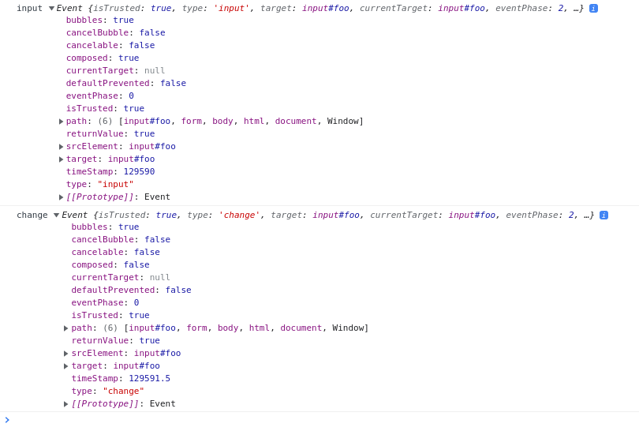
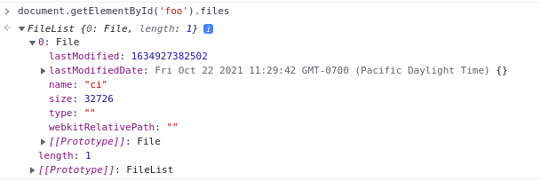

# `cy.attachFile` command

## Motivation
Working with file uploads in the browser is tricky business. They can be attached to `<input>` elements directly or dropped into the browser window, individually or as a folder, and regardless of the desired user interaction, testing the process has browser-specific quirks a developer needs to be aware of.

Our users would very much like cypress to provide this functionality out-of-the-box, as evidenced by the popularity of the existing [Cypress File Upload](https://github.com/abramenal/cypress-file-upload) plugin and the [dozen or so issues](https://github.com/cypress-io/cypress/issues?q=is%3Aissue+https%3A%2F%2Fgithub.com%2Fabramenal%2Fcypress-file-upload) with hundreds of comments [going back to 2016](https://github.com/cypress-io/cypress/issues/170). While the plugin works, a first-party solution would be preferable, both for discoverability and for improved integration with the existing set of commands.

## Goals and non-goals
As part of this initiative, we would like to supply builtin `cy` commands which allow tests to interact with files in the browser as a user would, both by selecting files on `<input type="file" />` elements and by dragging them onto the screen. We would like to hide the complexity of handling this across browsers and versions, but still allow tests to customize the behavior as necessary.

This proposal does not include the ability to upload _folders_. While users have requested this feature from cypress-file-upload, and it would be nice to include, we instead submit that it should be left for a follow-up ticket or initiative. The API outlined here is flexible enough to easily add support for folders at a later date - see [this PR](https://github.com/abramenal/cypress-file-upload/pull/288/files) if you wish to learn more about the technical side of uploading folders.

## Proposal
As part of this initiative, we would like to add a new command, `cy.attachFile()`.


In the simplest case, the user attaches a single file to an HTML5 input element. This can be done with the path to a file (a'la `cy.readFile()`), the `'fixture:filename'` shorthand, or by using an `@alias`. In addition it supports Buffers, for content not loaded from disk or dynamically processed at runtime.
```js
  cy.readFile('path/to/file.json').as('myFile')
  cy.fixture('users.json').as('myFixture')

  cy.get('input[type=file]').attachFile('path/to/file.json')
  cy.get('input[type=file]').attachFile('fixture:users.json')

  // If the referenced alias is not a Buffer or string, cypress will use
  // JSON.stringify() before attaching it.
  cy.get('input[type=file]').attachFile('@myFixture')
  cy.get('input[type=file]').attachFile('@myFile')

  // Buffers can be passed in directly. Strings, objects and arrays are
  // already interpreted by attachFile in various ways explained below.
  cy.get('input[type=file]').attachFile(Buffer.from('foo'))
  cy.readFile('path/to/file.json').then((file) => {
    // Process file contents dynamically
    file.users = ['John Doe']
    cy.get('input[type=file]').attachFile(Buffer.from(JSON.stringify(file)))
  })
```

This triggers `input` and `change` events on the given input element, signaling to the browser that a file has been attached. We will trigger all events related to `cy.attachFile` via the driver, rather than via Chrome Debugger Protocol (CDP); See [Trade Offs](#trade-offs) for more details on this decision.

It also supports arrays of files, representing a user selecting multiple files at once. If the input element does not have `multiple` property, an error will be thrown.

```js
  cy.get('input[type=file]').attachFile(['fixture:users.json', '@myFile'])
```

For more precise control, a user can pass in an object (or array of objects) giving details about the files:
```js
  cy.get('input[type=file]').attachFile({
    contents: '@myBuffer',
    filePath: '/imaginary/path/to/file.txt',
    lastModified: Date.now(),
    mimeType: 'application/octet-stream',
  })
```

- `contents` can be any of the above formats - `fixture:file.json`, an `@alias`, or a `Buffer()`. Required.
- `filePath` is a string. If undefined, it defaults to the actual path (if we have one from `cy.readFile()` or `cy.fixture()`), or an empty string if none can be inferred.
- `lastModified` defaults to `Date.now()`.
- `mimeType` does not have a default value, allowing the browser to infer it.

In addition, a second argument can be provided to configure how the action is performed.

```js
  // Defaults
  cy.get('input[type=file]').attachFile('@myFile', {
    force: false,
    action: 'input',
  })

  // Other choice for each option
  cy.document().attachFile('@myFile', {
    force: true,
    action: 'drag-n-drop',
  })
```

- `force` defaults to false, respecting cypress' actionability and visibility checks. The ability to override this is especially important for `attachFile()` because in modern applications `<input>` elements are often hidden behind `<labels>` or other elements which trigger the file prompt.
- `action` defaults to `input`, mimicking a selecting a file on an HTML5 input element. The other option is `drag-n-drop`, which simulates a user dropping files onto the element.

### `drag-n-drop`
Setting the action to `drag-n-drop` changes the behavior of the command in several ways:
- The user action it is simulating is different - dragging a file onto the browser rather than selecting one from a native browser popup.
- The DOM events the browser fires are different - `['drag', 'dragenter', 'dragover', 'drop']` in addition to `['input', 'change']`.
  - Note that `dragstart` and `dragend` are [not fired](https://developer.mozilla.org/en-US/docs/Web/API/HTML_Drag_and_Drop_API/File_drag_and_drop) when dragging a file into the browser from the OS - they are only used when dragging elements within a document.
  - As a complication in debugging, `monitorEvents()` in Chrome Devtools does not display any drag events, only the mouse events that ultimately trigger them.
- Files can be dragged and dropped onto any element, including the global `document`, while `attachFile()` only makes sense for `<input type="file">` and `<label for="fileInput">` elements.

### Targeting
The details of this section have been refined as far as possible by browser testing, but changes may occur as we dive deeper into the implementation and the ecosystem around file uploads reacts to various events. These steps are based on the goal of replicating how the browser behaves under real human interaction as closely as possible.

Action `input`:
1. Check actionability for current subject unless `force: true`.
2. Locate an `<input type="file">` element.
  1. If the current subject is one, use that.
  2. If the current subject is a `<label>`, look for the referenced `<input>` element. Do not recheck actionability - hidden `<input>`s are standard practice.
  3. If we haven't found an `<input>` element, or it isn't of `type="file"`, trigger an error. Elements other than HTML5 file inputs can't have files attached to them.
  4. If the user has provided multiple files, and the `input` does not have the `multiple` attribute, trigger an error.
3. Attach the files to located input element, and trigger `['input', 'change']` events on it.

Action `drag-n-drop`:
1. Check actionability for current subject unless `force: true`.
2. Trigger `['drag', 'dragenter', 'dragover', 'drop']` with the file attached on the current subject.
3. If the current subject is a `<input type="file">` element:
  1. If only one file is provided, or the element has the `multiple` attribute, attach the files to it and trigger the `['input', 'change']` events.
  2. If the user has provided multiple files and the `input` does *not* have the `multiple` attribute, do nothing. We do not trigger an error, as real users may attempt this, but neither do we attach files to the element.

Drag-n-drop does *not* do a `<label>` -> `<input>` search - this mimics browser behavior. Dropping a file over a `<label>` does not update the input element it's connected to.

## Trade-offs
`cy.attachFile` does not respect the `accept` attribute of `<input>` elements. The accept attribute is extremely flexible, and properly verifying that a Buffer or string matches a specific mimeType is beyond the scope of this feature.

Even though `attachFile` behaves differently when a flag is passed ("input" vs "drag-n-drop"), keeping it as a single command has the benefit of reduced duplication - since they share the same arguments, there's no need to copy documentation and keep them different versions in sync.

### cypress-upload-file plugin
Currently, when a user (or a plugin they've installed) calls `Cypress.Commands.add()`, we add the command if it does not exist, or silently overwrite it if it already does. As part of this effort however, we're making Cypress [throw an error](https://github.com/cypress-io/cypress/pull/18587) if `add()` is used on a command that Cypress adds internally. `Cypress.Commands.overwrite()` still exists if the user still wishes to override builtin behavior.

This is done because the existing community solution, [cypress-upload-plugin](https://github.com/abramenal/cypress-file-upload), already adds `cy.attachFile`, and we believe a visible conflict is the best way forward. The maintainers of that project can simply switch from `add` to `overwite` in order to keep it working, which shouldn't be too onerous of a burden. For users, this error will serve as a way to notify users of that plugin that native functionality now exists, so they can decide which they prefer to use.

As part of the changelog around this feature, we will need to write a migration guide for current users of the plugin. Since our version of `cy.attachFile` is extremely similar to that of the plugin, for many users this should be as simple as changing `subjectType` to `action`, prefixing their fixtures with `fixture:` and uninstalling cypress-upload-file.

### Synthetic events vs CDP
Events triggered by Chrome Devtools Protocol and real users are identical, while those triggered via JS are different only in the `isTrusted` property (see below for more details on this conclusion). The same holds for the drag-and-drop related events, with the exact method to reproduce omitted here for brevity.


Triggering the [`DOM.setFileInputFiles` event via CDP](https://chromedevtools.github.io/devtools-protocol/tot/DOM/#method-setFileInputFiles) also has a major limitation: it accepts only an array of file paths, which are read from disk. This has a benefit:
1. The files are not read from disk until the application does so - this is how browsers actually behave, and is more performant, especially when dealing with large files.

And two drawbacks:
1. The files *must* be read from disk. We would have to either drop support for Buffers / aliases and only allow `cy.attachFile` to accept paths from disk, or we would have to write the Buffer to a temporary file and use that path.
2. We cannot allow users to control the `fileName` or `lastModified` properties - they are read from disk.

In favor of a more intuitive and powerful API, we have opted to trigger the input events synthetically from the driver JS rather than via CDP. To use CDP we would have to scale back the scope of the API, removing features our users are accustomed to from the 3rd party plugin and requiring them to write to disk any time they wish to modify the data attached to an element.

### Browser behavior / CDP / Synthetic event research
Consider the following snippet:

```js
(() => {
  document.body.innerHTML = `
  <form action="#">
    <label for="foo">Label</label>
    <input type="file" id="foo" />
  </form>
  `
  monitorEvents(i)
})()
```

We can interact with this in three different ways:

1. Visually in the browser, click on the file input and select a file. Henceforth referred to as "Actual user".
2. Via CDP, in a series of commands (you'll have to edit the nodeIds to match what CDP gives you):
```json
{"command": "DOM.getDocument"}
{"command": "DOM.querySelector", "parameters": {"nodeId": 1, "selector": "#foo"}}
{"command": "DOM.setFileInputFiles", "parameters": {"nodeId": 8, "files": ["/home/bluewinds/Cypress/ci"] }}
```
3. Via javascript running directly in the browser.

```js
 const i = document.getElementById('foo')

  const fileContents = 'foo'
  const fileName = 'ci'
  const f = new File([fileContents], fileName, {
    type: 'text/plain',
    lastModified: Date.now()
  });

  const dt = new DataTransfer();
  dt.items.add(f)

  i.files = dt.files
  const e = new Event('input', { bubbles: true, composed: true })
  const e2 = new Event('change', { bubbles: true })
  i.dispatchEvent(e)
  i.dispatchEvent(e2)
```

In all three cases, the visual is identical:


The events dispatched are identical between an actual user and CDP, though of course an actual user triggers a great many others (mouse over, mouse down, mouse up, click, blur, etc...):



The events triggered from JS are very similar, the one difference being the "isTrusted" property is now false.
> The isTrusted read-only property of the Event interface is a boolean value that is true when the event was generated by a user action, and false when the event was created or modified by a script or dispatched via EventTarget.dispatchEvent().

Otherwise, all event properties are identical. We'll also need to special case Chrome <84 here - we don't need to manually dispatch the 'change' event in JS, in older chrome versions that gets fired automatically when we do `i.files = dt.files`.

The events don't actually contain the file contents though - that you have to read off the `input` element itself: `i.files[0]`. It is identical in all cases:



Reading file data looks something like this:

```js
i.files[0].arrayBuffer().then(contents => { console.log(contents) })
> ArrayBuffer(206)
```

again, independent of how the File object was attached to the input.

All of the above holds true for the drag-and-drop related events, with the exact method to reproduce omitted here for brevity. The only difference between synthetic events and CDP / actual user is the `isTrusted` property.

## Further Investigation
- Lessons to be learned from other projects (Playwright, Puppeteer, or TestCafe) around file uploads or common issues encountered is ongoing.
- Testing to ensure we support common file upload frameworks and plugins will be vital as part of implementation.

## References
- 2016 issue with 104 upvotes requesting this feature: https://github.com/cypress-io/cypress/issues/170
- Existing, stable and well used community implementation of `cy.attachFile()`: https://github.com/abramenal/cypress-file-upload
- CDP method for setting attached files on an Input element: https://chromedevtools.github.io/devtools-protocol/tot/DOM/#method-setFileInputFiles
- Prerequisite work already done, necessary for this proposal and perenial thorn in cypress-file-upload's side: https://github.com/cypress-io/cypress/pull/18534
