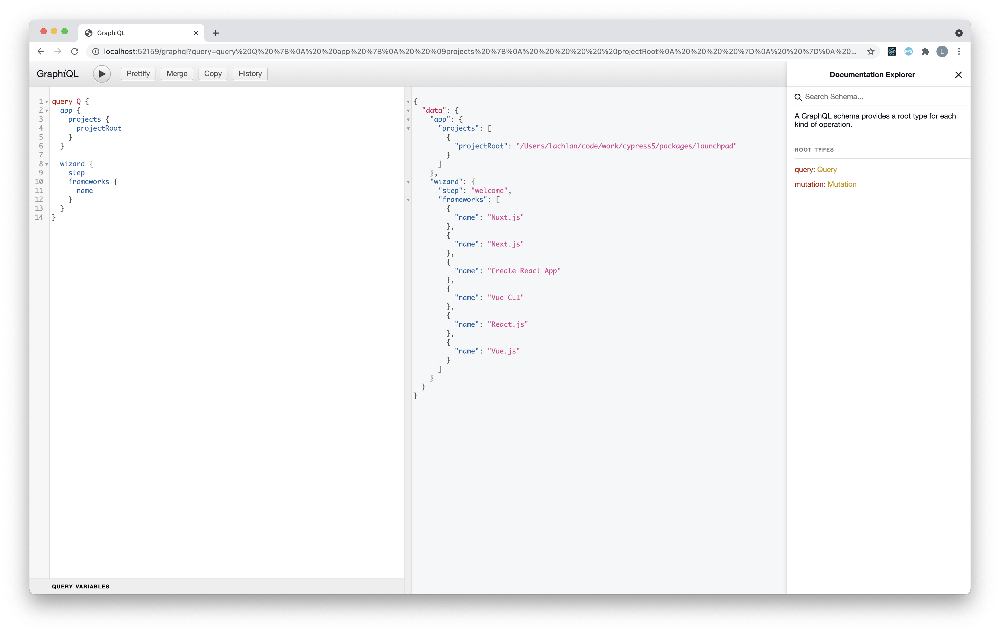

# Launchpad

Launchpad is next-gen Vue application that is rendered by Electron. This acts as the visual user interface you see when running: `cypress open`.

It replaces the original electron app, `desktop-gui`.

**Launchpad has the following responsibilities:**

- Allow users to log in through Cypress Cloud
- Onboarding for new users (configure Component Testing dev server, install dependencies, etc)
- Select testing mode (E2E, Component)
- Provide UI to perform automated migration steps (for example migrating `cypress.json` to `cypress.config.js` for projects upgrading from 9.x or below)
- Provide a dismissable Welcome Screen for every major release of Cypress

It is using the following technologies:

- [Vue 3](https://v3.vuejs.org/guide/introduction.html) for the UI framework
  - code is written with the [Composition API](https://v3.vuejs.org/guide/composition-api-introduction.html) 
  - uses the new [`<script setup>`](https://v3.vuejs.org/api/sfc-script-setup.html#basic-syntax) syntax for better TypeScript support
- [Vite](https://vitejs.dev/) for the dev server
- TypeScript
- [Urql](https://formidable.com/open-source/urql/) for the GraphQL client

More details on the front-end setup are found in the `@packages/frontend-shared` [package README](../frontend-shared/README.md).

Cypress' entire back-end is powered by the `@packages/server` package. Launchpad interfaces with it via a GraphQL layer, found in `@packages/graphql`.

[Here is a short tutorial](https://github.com/lmiller1990/vue-3-urql-example) building a simple app using the same technologies we are using for launchpad. There are a lot of moving pieces; understanding how everything works will help you contribute to Launchpad.

## Major Version Welcome Content

The content is bundled with the launchpad and at the time of writing this, it lives in `src/migration/MajorVersionWelcome.vue`. Shipping it as part of the app means it is always available upon release and it will always work offline. Guidelines for the management of the content itself are documented internally in our `prod-eng-docs`, but the implementation is documented here.

A constant named `MAJOR_VERSION_FOR_CONTENT` defines which major version the content is associated with for the purposes of recording user dismissal in persisted state. This needs to be bumped to match the major version that will be released, since that value is the key that records the dismissal.

All changes to the content itself, and to the `MAJOR_VERSION_FOR_CONTENT`, must be made as Pull Requests into the `release/x.x.x` branch for that major version, not merged directly to develop. A new Major Version Landing page is considered a "breaking change" that shouldn't be on `develop`, since it would be incorrect if we released a patch and users started to see a Welcome Screen for the next major. 

Note: release dates displayed on this page are stored in the code, not pulled from npm, with entries in the `versionReleaseDates` computed value. This is so they work offline and render right away without waiting for a network call.

## Building

### For development

```bash
## from repo root
yarn workspace @packages/launchpad build
```

## Developing

For the best development experience, you will want to use VS Code with the [Volar](https://marketplace.visualstudio.com/items?itemName=Vue.volar) extension. This will give you type completion inside `vue` files.


```bash
## from repo root
yarn watch
```

This starts Vite in watch mode, and any code-generation scripts that need to be running in the background to support our environment. While developing, you might want to consider the [CYPRESS_INTERNAL_VITE_DEV](../../CONTRIBUTING.md#internal-vite-options) option.

In a separate terminal, run:

```bash
## from repo root
yarn cypress:open
```

This starts the GraphQL Server, and opens Cypress. By running this separate from the `yarn watch`, you can kill & respawn the Cypress binary without the overhead of the watch processes you'd see by running `yarn dev`. 

You can access the GraphQL inspector on `http://localhost:52200/graphql`.



If you notice your IDE has not updated and is showing errors, even after `yarn watch` has run, you might need to reload your IDE. With the amount of code generation running, sometimes the IDE does not recognize that the code has changed.

## Testing

### In Cypress

This project is tested with Cypress itself. It acts exactly like any other Cypress project. It has more component tests than E2E, as we are using Launchpad to dogfood Component Testing.

Component Tests:

```bash
## from repo root
yarn workspace @packages/launchpad cypress:open:ct
```

E2E tests:

```bash
## from repo root
yarn workspace @packages/launchpad cypress:open
```
