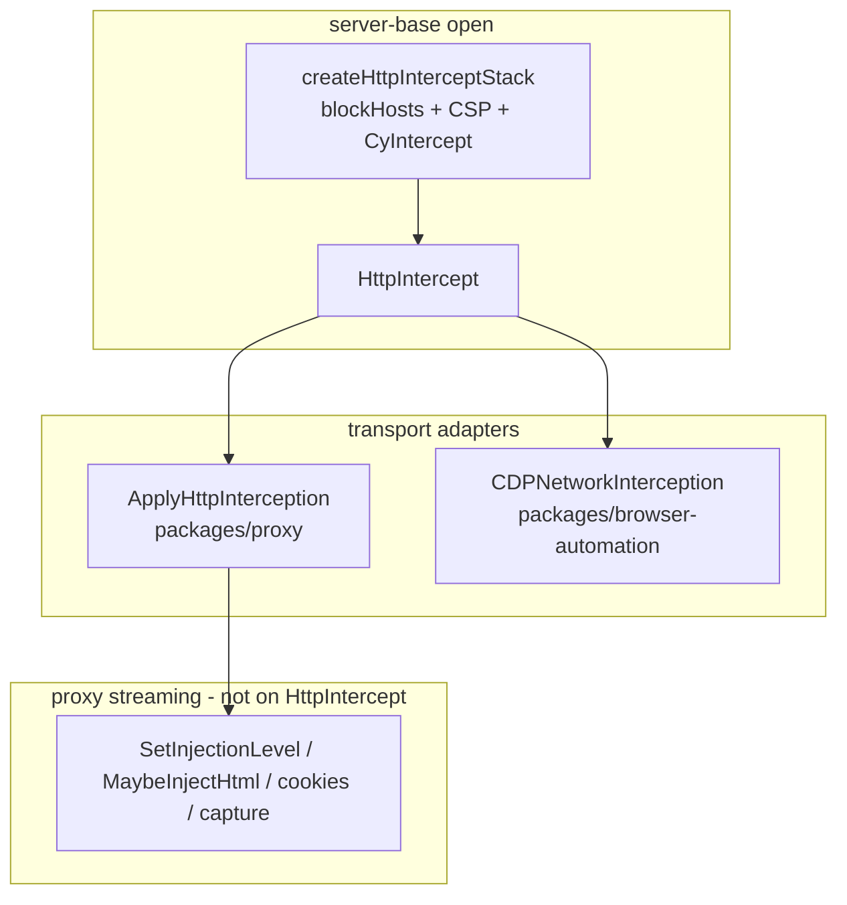

# @packages/network-interception

Types and **port interfaces** for Cypress network interception (`cy.intercept`, config policies, proxy middleware). Part of the stacked refactor in [#33919](https://github.com/cypress-io/cypress/issues/33919) to support HTTP/2 (CDP Fetch / BiDi) without rewriting intercept logic.

> **`HttpIntercept.handle(request, next)`** is the driving port for per-request intercept. Proxy and CDP adapters call it; the onion stack owns route matching, subscription orchestration, and handler merge. Cookies, injection, compression, and capture remain proxy driven ports.

---

## Why this refactor uses ports and adapters

Intercept code today lives inside `@packages/proxy` and `@packages/net-stubbing` middleware with a hard dependency on the MITM proxy transport. The HTTP/2 program needs the **same** matching, handler, and policy behavior while swapping **how** requests leave the browser (proxy vs CDP Fetch).

The codebase adopts **hexagonal architecture** (also called **ports and adapters**): keep interception rules in a transport-agnostic center, isolate I/O behind interfaces, plug in different implementations per transport.

---

## Hexagonal terms → this repo

| Hex term | Role | In this monorepo |
| --- | --- | --- |
| **Port** | Contract at the edge of the interception "inside" | `For*` types in `lib/ports/` |
| **Adapter** | Implements a port by delegating to existing Cypress code | `*Adapter` classes under `packages/*/lib/adapters/` |
| **Driving port** (primary) | Outside actors **call into** interception | `ForHttpIntercept` |
| **Driven port** (secondary) | Interception **calls out** for I/O | `ForInterceptionEvents`, `ForCookieState`, … |
| **Core** | Domain orchestration without transport imports | **`HttpIntercept`** |
| **Composition root** | Constructs and injects adapters + core | `server-base.open()` |

The **core** is the hexagonal "inside": it may call **driven ports** but must not import proxy or net-stubbing directly.

---

## `HttpIntercept.use(middleware)` and `handle(request, next)`

Transport-neutral onion stack for config middleware and the cy.intercept intercepter:

```typescript
type InterceptMiddleware = (
  request: HttpRequest,
  next: OriginForwarder,
) => Promise<HttpResponse>
```

| Semantics | Behavior |
| --- | --- |
| No matching routes | `return next(request)` |
| CORS preflight match | Fulfill 204 without calling `next` |
| Static stub / request-stage `req.reply` | Return synthetic response, never call `next` |
| Pass-through / header mutate | `const res = await next(modified); return applyResponseIntercept(res)` |
| `next` | Callable **at most once** — origin boundary (proxy Node HTTP fetch or CDP continue) |

`inFlightInterceptId` is **adapter-owned** (proxy generates uuid). Core correlates driver subscriptions via that id while an intercept is in flight.

`ForInterceptionEvents` keeps `@packages/socket` out of core: `emitAndAwait`, `emit`, `resolveEventHandler`.

---

## Wiring



```
server-base.open()
  → createHttpInterceptStack(config, socket) — blockHosts, CSP, CyIntercept on one HttpIntercept
  → if proxy enabled: createNetworkProxy() with proxy driven ports
  → if proxy disabled: open_project passes same HttpIntercept to CDPNetworkInterception

ApplyHttpInterception middleware (proxy path)
  → networkInterception.handle(toHttpRequest(ctx), createFetchOrigin)
  → HttpResponseCodec.toProxyResponse / commitHttpResponseToProxy

CDPNetworkInterception (CDP path)
  → networkInterception.handle(toHttpRequest(pause), forwardViaFetch)
  → Fetch.fulfillRequest / Fetch.continueRequest
```

Config middleware (`blockHosts`, CSP) and the cy.intercept intercepter share one `HttpIntercept` onion chain. Cookies, document prep, and compression stay on proxy middleware via driven ports wired at the composition root.

---

## Porting proxy concerns to `InterceptMiddleware`

Use this when a concern can run on materialized `HttpRequest` / `HttpResponse` (both proxy and CDP call `handle()`).

| Concern | Where middleware is defined | Where it is registered | Runs on CDP? |
| --- | --- | --- | --- |
| `blockHosts` | `createBlockConfiguredHosts` (`network-interception`) | `createHttpInterceptStack` (`server`) | Yes (same stack) |
| CSP allow-list | `createCspConfiguredAllowList` (`network-interception`) | `createHttpInterceptStack` (`server`) | Yes (same stack) |
| `cy.intercept` | `CyIntercept` (`net-stubbing`) | `createHttpInterceptStack` (`server`) | Yes |
| Document rewrite | `SetInjectionLevel` → `MaybeInjectHtml` → `MaybeRemoveSecurity` (`proxy` streaming) | `server-base` wires `createProxyNetworkServices()` driven ports | No (intentional) |

**Keep on proxy streaming middleware** when the concern needs the response byte stream (gzip/br), multiple response-stage hooks, or is proxy-only for now:

| Concern | Where it stays | Why |
| --- | --- | --- |
| Document rewrite (`modifyObstructiveCode`, injection, security strip) | `SetInjectionLevel` → `MaybeInjectHtml` → `MaybeRemoveSecurity` in `@packages/proxy` | Stream rewrite; buffering in `HttpIntercept` would break large payloads |
| Cookies, command log, Test Replay capture | Proxy driven ports (`ForCookieState`, …) | Not required for `cy.intercept` CDP parity |

Composition root (`server-base.open()`) builds one `HttpIntercept`, registers config + driver middleware, then passes the same instance to `NetworkProxy` or `CDPNetworkInterception`.

---

## CDP vs proxy (`CYPRESS_INTERNAL_DISABLE_PROXY=1`)

**CDP scope for this stack: `cy.intercept` parity.** Config middleware on the shared `HttpIntercept` stack also runs on CDP, but full behavioral parity (cookies, injection, capture) is not a goal.

| Feature | Proxy (MITM) | CDP Fetch |
| --- | --- | --- |
| `cy.intercept` | Yes | Yes |
| `blockHosts` | Yes (`HttpIntercept` middleware) | Yes (same stack) |
| `experimentalCspAllowList` | Yes (`HttpIntercept` middleware) | Yes (same stack) |
| `modifyObstructiveCode` / HTML injection | Yes (streaming response middleware) | **No** |
| Framebusting / security strip | Yes (streaming response middleware) | **No** |
| Cross-origin cookie jar sync | Yes | **No** |
| Network command-log entries | Yes | **No** |
| Test Replay capture | Yes | **No** |

Document rewrite (`modifyObstructiveCode`, `experimentalModifyObstructiveThirdPartyCode`) is configured via {@link DocumentRewriteConfig} at the composition root but **enforced only on the proxy path**: `SetInjectionLevel` → `MaybeInjectHtml` → `MaybeRemoveSecurity` in `@packages/proxy`, backed by {@link ForDocumentPreparation}. Responses are gzip/br streams; materializing bodies in `HttpIntercept` would break large payloads and duplicate compression logic.

System-level `cy.intercept` smoke with proxy disabled: `system-tests/test/cdp_network_intercept_spec.js` (`fetch.cy.js` under `CYPRESS_INTERNAL_DISABLE_PROXY=1`).

**Tests:** `@packages/browser-automation` unit specs use a mocked `handle` (CDP transport only). `cy.intercept` stack integration (real `HttpIntercept` + `CyIntercept`) lives in `@packages/server` (`test/unit/browsers/cdp-cy-intercept-integration_spec.ts`).

---

## Development

```bash
yarn workspace @packages/network-interception test
yarn workspace @packages/net-stubbing test
yarn workspace @packages/browser-automation test
yarn workspace @packages/server test-unit -- test/unit/browsers/cdp-cy-intercept-integration_spec.ts
yarn workspace @packages/proxy test
```

[#33919](https://github.com/cypress-io/cypress/issues/33919)
