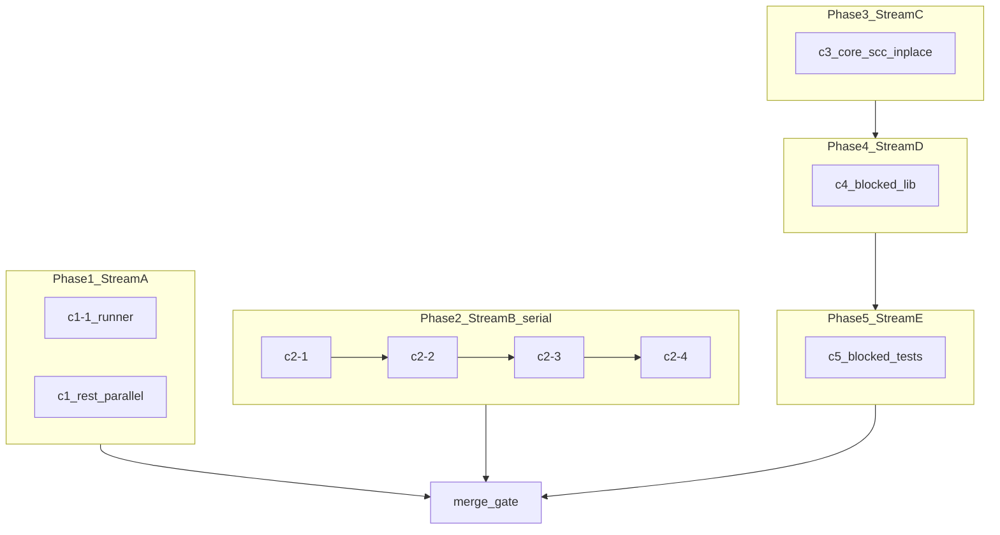

# [Epic] [ESM] @packages/server — Node ESM migration (graph-ordered sub-issues)

This issue **tracks ordering and dependencies** for the `@packages/server` ESM migration. Each child item maps to a markdown spec in [`packages/server/docs/esm-migration/github-issues/`](./): create a GitHub issue from that file (`gh issue create --body-file …`), then **edit the checklist below** to replace `./foo.md` with `#123` (or use GitHub **sub-issues** / Project fields).

**Suggested labels:** `area/server`, `epic`, `esm-migration`  
**Depends on nothing** (this is the umbrella). Close when **merge gate** and agreed exit criteria are done.

## Goal

Move `packages/server` toward **ESM** without breaking the Electron binary, plugin child processes, or the V8 snapshot path. **Strongly connected components (SCCs) are migrated in place**—no refactors whose purpose is removing dependency cycles; use static `import`/`export` where safe and dynamic `import()` only where static cycles break initialization. Work is chunked (≤ ~2500 LOC per sub-issue, `wc -l`) and ordered using [server-graph-toposorted.json](./server-graph-toposorted.json).

## References

- Cursor plan: `server_esm_three_streams_df4e7bba.plan.md` (local; link here if published)
- Sub-issue specs: [README.md](./README.md) (index of all `c*.md` + merge gate)
- [packages/server/AGENTS.md](../../../AGENTS.md)

## Ordering rules (summary)

1. **Do not** set `"type": "module"` in `package.json` until **[merge gate](./merge-gate-package-type-module.md)** — sub-issues assume this unless they explicitly say otherwise.
2. **Stream A (C1):** Prefer landing **[C1.1](./c1-1-runner-entry-eslint.md)** early so the test runner/spec loading supports the rest; other **C1.2–C1.8** chunks may run **in parallel** (disjoint files).
3. **Stream B (C2):** **Recommended order** C2.1 → C2.2 → C2.3 → C2.4 to reduce merge conflicts on the modes SCC (not because cycles must be removed). Parallel work is OK if file ownership is disjoint.
4. **Stream C (C3):** **C3.1–C3.8** may run **in parallel** with **strict file ownership**; **the core SCC may remain** after migration. Coordinate PRs that touch the same mutual imports.
5. **Stream D (C4):** After the **C3 chunks** for modules you depend on are migrated in place (graph may still show cycles). **C4.1–C4.3** parallel; **[C4.4](./c4-4-app-shell.md)** coordinates with browser façade work.
6. **Stream E (C5):** After the **production modules** each spec covers exist in ESM shape (**C3/C4**); batches **C5.1–C5.7** can parallelize by area.
7. **Merge gate:** **[Last](./merge-gate-package-type-module.md)** — package `type`, tsconfig, entries, snapshot/tooling sign-off.

---

## Phase 1 — Stream A: tooling and topological tests

**When:** Can start immediately. **Calendar overlap** with Phases 2–3 is fine; avoid conflicting edits on the same file.

### Recommended first

- [ ] [C1.1 — Test runner, entries, ESLint](./c1-1-runner-entry-eslint.md)

### Parallel (any order after C1.1 or concurrent if runner unchanged)

- [ ] [C1.2 — reporter + request](./c1-2-reporter-request.md)
- [ ] [C1.3 — Plugin child + small lib JS](./c1-3-plugins-child-small-js.md)
- [ ] [C1.4 — lib/util/*.js](./c1-4-util-js.md)
- [ ] [C1.5 — test/unit/util batch A](./c1-5-unit-util-specs-batch-a.md)
- [ ] [C1.6 — test/unit/util batch B](./c1-6-unit-util-specs-batch-b.md)
- [ ] [C1.7 — test/unit/util batch C](./c1-7-unit-util-specs-batch-c.md)
- [ ] [C1.8 — fixtures, support, automation specs](./c1-8-fixtures-support-automation-specs.md)
- [ ] [C1.8 — http_requests integration (oversized file)](./c1-8-http-requests-integration-spec.md)
- [ ] [C1.8 — integration CLI / cypress / cloud extract](./c1-8-integration-cli-cypress-cloud.md)
- [ ] [C1.8 — integration server / websocket / perf](./c1-8-integration-server-websocket-performance.md)
- [ ] [C1.8 — unit chrome_spec](./c1-8-unit-browser-chrome-spec.md)
- [ ] [C1.8 — unit electron + memory](./c1-8-unit-browser-electron-memory.md)
- [ ] [C1.8 — unit cloud API session / artifacts](./c1-8-unit-cloud-api-session-artifacts.md)
- [ ] [C1.8 — unit cloud API errors / metadata](./c1-8-unit-cloud-api-errors-metadata.md)
- [ ] [C1.8 — unit cloud network / studio / user](./c1-8-unit-cloud-network-studio-user.md)
- [ ] [C1.8 — unit config / GUI / errors / iframes / modes info](./c1-8-unit-config-gui-errors-iframes-modes-info.md)
- [ ] [C1.8 — unit modes / plugins / open_project](./c1-8-unit-modes-plugins-open-project.md)
- [ ] [C1.8 — unit project / reporter / remote_states](./c1-8-unit-project-reporter-remote.md)
- [ ] [C1.8 — unit request / saved_state / screenshots / server-base](./c1-8-unit-request-saved-screenshots-server-base.md)
- [ ] [C1.8 — unit snapshot / socket / task / template / xhrs](./c1-8-unit-snapshot-socket-task-remaining.md)

---

## Phase 2 — Stream B: modes / print-run / upload SCC

**When:** May overlap **Phase 1** on the calendar. Checklist order is **recommended** for conflict reduction, not a cycle-removal requirement.

- [ ] [C2.1 — upload + pass + results + print protocol error](./c2-1-modes-upload-results.md)
- [ ] [C2.2 — modes/run.ts](./c2-2-modes-run.md)
- [ ] [C2.3 — record + print-run](./c2-3-modes-record-print-run.md)
- [ ] [C2.4 — modes/index + info](./c2-4-modes-index-info.md)

---

## Phase 3 — Stream C: core SCC (automation / browsers / cloud / server)

**When:** May overlap other phases on the calendar. Run **C3.1–C3.8** in parallel with **strict file ownership**; migrate **in place** (SCC may remain). Coordinate overlapping imports.

- [ ] [C3.1 — Automation SCC members](./c3-1-automation-scc.md)
- [ ] [C3.2 — CDP + CRI stack](./c3-2-browsers-cdp-cri.md)
- [ ] [C3.3 — Browser index, types, utils, memory](./c3-3-browsers-index-utils-memory.md)
- [ ] [C3.4 — Cloud API SCC subset](./c3-4-cloud-api-scc.md)
- [ ] [C3.5 — Cloud studio + cy-prompt lifecycle](./c3-5-cloud-studio-cy-prompt.md)
- [ ] [C3.6 — Errors, fixture, plugins, controllers, cookies](./c3-6-errors-fixture-plugins-controllers-cookies.md)
- [ ] [C3.7 — Routes + socket stack](./c3-7-routes-socket.md)
- [ ] [C3.8 — project-base + server-base](./c3-8-project-server-base.md)

---

## Phase 4 — Stream D: blocked `lib/**` (browser façade + app shell)

**When:** After relevant **Phase 3** chunks for your dependencies are done (graph may still be cyclic). **C4.1–C4.3** in parallel; **C4.4** last or coordinated.

- [ ] [C4.1 — BiDi + browser-cri-client](./c4-1-bidi-browser-cri.md)
- [ ] [C4.2 — Chrome + Electron](./c4-2-chrome-electron.md)
- [ ] [C4.3 — Firefox + WebKit + protocol](./c4-3-firefox-webkit-protocol.md)
- [ ] [C4.4 — App shell + settings](./c4-4-app-shell.md)

---

## Phase 5 — Stream E: blocked tests

**When:** After the **implementation** touched by each spec exists in the target module shape (Phases 3–4). Batches may run in parallel by area.

- [ ] [C5.1 — Integration + key_press](./c5-1-integration-automation-keypress.md)
- [ ] [C5.2 — bidi_automation_spec](./c5-2-bidi-automation-spec.md)
- [ ] [C5.3 — browser-cri + browsers + CDP queue/connection](./c5-3-browser-cri-cdp-queue-connection.md)
- [ ] [C5.4 — CDP automation + CRI + Firefox](./c5-4-cdp-automation-cri-firefox.md)
- [ ] [C5.5 — memory + protocol + cloud API + artifacts](./c5-5-memory-protocol-cloud-api-artifacts.md)
- [ ] [C5.6 — cy-prompt + studio lifecycle](./c5-6-cloud-lifecycle-specs.md)
- [ ] [C5.7 — files + fixture + routes](./c5-7-files-fixture-routes.md)

---

## Phase 6 — Merge gate (close epic here)

- [ ] [Merge gate — `type: module`, tsconfig, snapshot, full matrix](./merge-gate-package-type-module.md)

---

## Epic completion criteria

- [ ] All phase checklists above are done (or explicitly waived with reason in a comment).
- [ ] `yarn workspace @packages/server check-ts`, `test-unit`, and `test-integration` pass on `develop` (or target branch).
- [ ] Electron dev workflow verified per [AGENTS.md](../../../AGENTS.md).
- [ ] Dependency graph regenerated **optional**; **SCC count may stay nonzero**. Document anywhere **dynamic `import()` was required** for correctness (vs static ESM).
