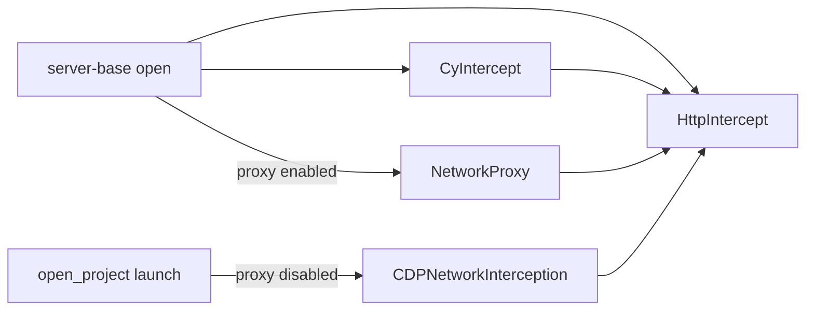

# Server adapters

**Adapters** for `@packages/network-interception` driven ports owned by the server composition root.

See [`packages/network-interception/README.md`](../../network-interception/README.md).

---

## Network composition

The composition root is [`lib/server-base.ts`](../server-base.ts) `open()`:

| Step | Code | Result |
| --- | --- | --- |
| 1. Config middleware | `createHttpInterceptWithDefaultMiddleware(config, { matchesBlockedHost })` | `HttpIntercept` with `blockHosts` + CSP `use()` layers |
| 2. Header strip | `createStripInternalHeaders(INTERCEPT_HEADERS)` | Removes Cypress-internal headers before `cy.intercept` |
| 3. Driver wiring | `new CyIntercept({ socket, config, onSyncInterceptSkipped })` then `httpIntercept.use(cyIntercept.middleware)` | Registers `cy.intercept` on the shared stack |
| 3a. Proxy path | `createNetworkProxy()` when proxy enabled | `NetworkProxy.networkInterception` = shared `HttpIntercept`; driven ports on `networkServices` |
| 3b. CDP path | `open_project.launch()` when `CYPRESS_INTERNAL_DISABLE_PROXY=1` | Passes `server.networkInterception` to browser launch |

| Concern | Wiring |
| --- | --- |
| `HttpIntercept` + config middleware | `createHttpInterceptWithDefaultMiddleware()` in `open()` |
| `cy.intercept` routes + driver events | `CyIntercept` on the stack; `socket-base` calls `cyIntercept.handleDriverEvent` |
| Proxy driven ports | `createProxyNetworkServices()` when proxy is enabled |
| CDP transport | Same `HttpIntercept` instance — no second stack |

Config middleware (`blockHosts`, CSP) registers on `HttpIntercept` via `use()`. Document rewrite (`modifyObstructiveCode`, `experimentalModifyObstructiveThirdPartyCode`) is typed via {@link DocumentRewriteConfig} but enforced only on proxy response streaming middleware — not on CDP Fetch. See [CDP vs proxy](../../network-interception/README.md#cdp-vs-proxy-cypress_internal_disable_proxy1) in `@packages/network-interception`.

### Tests

- `packages/network-interception/test/unit/register-default-intercept-middleware.spec.ts`
- `packages/server/test/unit/intercept-middleware/strip-internal-headers_spec.ts`
- `packages/server/test/unit/server-base_spec.ts`
- `packages/server/test/unit/browsers/cdp-cy-intercept-integration_spec.ts`
- `packages/server/test/unit/open_project_spec.ts`

[#33919](https://github.com/cypress-io/cypress/issues/33919)
