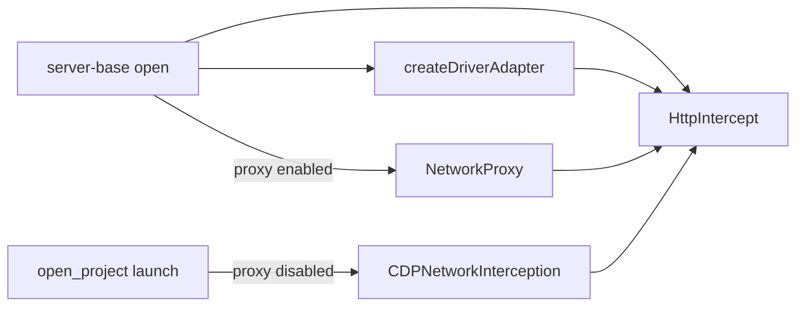

# Server adapters

**Adapters** for `@packages/network-interception` ports owned by the server composition root.

See [`packages/network-interception/README.md`](../../network-interception/README.md).

---

## Network composition

The server composition root is [`lib/server-base.ts`](../server-base.ts) `open()`:

| Step | Code | Result |
| --- | --- | --- |
| 1. Config middleware | `createHttpInterceptWithDefaultMiddleware(config, { matchesBlockedHost })` | `HttpIntercept` with `blockHosts` + CSP `use()` layers |
| 2. Driver wiring | `createDriverAdapter({ stubbing, socket, httpIntercept })` | Registers `CyInterceptInterceptor` on the same `HttpIntercept` |
| 3a. Proxy path | `createNetworkProxy()` when proxy enabled | `NetworkProxy.networkInterception` = shared `HttpIntercept`; `Proxy*Adapter` driven ports on `networkServices` |
| 3b. CDP path | `open_project.launch()` when `CYPRESS_INTERNAL_DISABLE_PROXY=1` | Passes `server.networkInterception` to browser launch; `BrowserCriClient.attachCdpNetworkInterception()` wraps `CDPNetworkInterception` |

| Concern | Wiring |
| --- | --- |
| `HttpIntercept` + config middleware | `createHttpInterceptWithDefaultMiddleware()` then `createDriverAdapter()` |
| `cy.intercept` routes | `netStubbingState()` passed to `createDriverAdapter` as `ForStubbing` |
| Proxy driven ports | `Proxy*Adapter` instances on `NetworkProxy.networkServices` when proxy is enabled |
| CDP transport | Same `HttpIntercept` instance — no second stack, no `createProxyRuntime()` |

Config middleware (`blockHosts`, CSP) registers on `HttpIntercept` via `use()`. Document rewrite (`modifyObstructiveCode`, `experimentalModifyObstructiveThirdPartyCode`) is typed via {@link DocumentRewriteConfig} but enforced only on proxy response streaming middleware — not on CDP Fetch. See [CDP vs proxy](../../network-interception/README.md#cdp-vs-proxy-cypress_internal_disable_proxy1) in `@packages/network-interception`.

### Tests

- `packages/network-interception/test/unit/register-default-intercept-middleware.spec.ts`
- `packages/server/test/unit/server-base_spec.ts` (proxy-disabled wiring assertions)
- `packages/server/test/unit/browsers/cdp-cy-intercept-integration_spec.ts` (real `HttpIntercept` + driver adapter + CDP)
- `packages/server/test/unit/open_project_spec.ts` (`networkInterception` passed to browser when proxy disabled)

[#33919](https://github.com/cypress-io/cypress/issues/33919)
