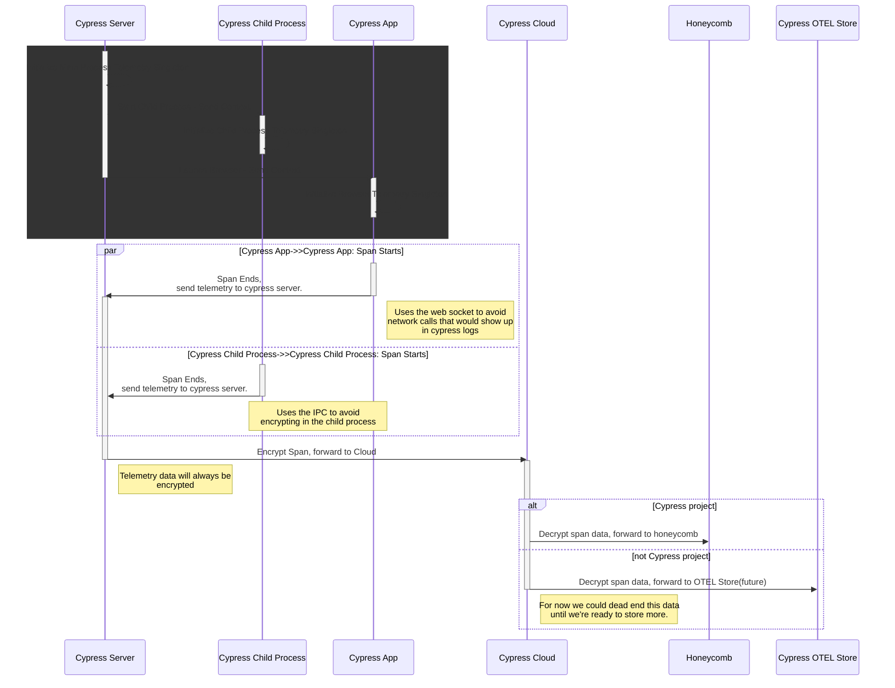

# @packages/telemetry

This package is convenience wrapper built around open telemetry to allow us to gain insights around how cypress is used and help us prevent performance regressions.

## tl;dr

Telemetry in cypress is off by default. To enable telemetry in cypress set `CYPRESS_INTERNAL_ENABLE_TELEMETRY="true"`.

Telemetry data is sent to the cloud `/telemetry` endpoint.

For the **cypress cloud project only** we forward the telemetry data to honeycomb. For all other projects telemetry data is not stored.

Staging: https://ui.honeycomb.io/cypress/environments/cypress-app-staging/datasets/cypress-app/home

Prod: https://ui.honeycomb.io/cypress/environments/cypress-app/datasets/cypress-app/home

## Design

## Setup

## Usage

### Spans

### Metrics

The metrics api is tbd.

## Open Telemetry Links

[otel docs](https://opentelemetry.io/docs/)
[otel sdk](https://open-telemetry.github.io/opentelemetry-js/index.html)
