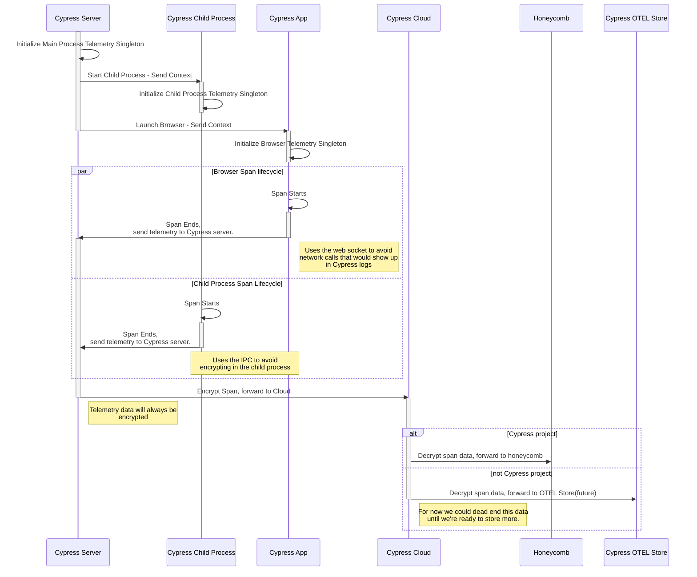

# @packages/telemetry

This package is a convenience wrapper built around [open telemetry](https://opentelemetry.io/) to allow us to gain insights around how Cypress is used and help us prevent performance regressions.

## tl;dr

Telemetry in Cypress is disabled by default. To enable telemetry in Cypress set `CYPRESS_INTERNAL_ENABLE_TELEMETRY="true"`.

Verbose telemetry in Cypress is disabled by default when telemetry is enabled. To enable verbose telemetry in Cypress set `CYPRESS_INTERNAL_ENABLE_TELEMETRY_VERBOSE="true"`. This will enable telemetry for areas of the code that report a lot of events, such as the `@packages/proxy` code.

For local development and more immediate feedback, enable console output by setting `CYPRESS_INTERNAL_USE_CONSOLE_EXPORTER="true"`.

Telemetry data is sent to the cloud `/telemetry` endpoint.

For the **Cypress cloud project only** we forward the telemetry data to [honeycomb](https://ui.honeycomb.io/cypress). For all other projects telemetry data is not stored.

Environments:
* [Staging](https://ui.honeycomb.io/cypress/environments/cypress-app-staging/datasets/cypress-app/home)
* [Production](https://ui.honeycomb.io/cypress/environments/cypress-app/datasets/cypress-app/home)

## Design

At a very high level we use open telemetry to collect data and send it to honeycomb. There are three different processes that collect data, the server, the child process and the browser. The child process and browser forward collected spans to the server where the telemetry data is encrypted and sent to the Cypress Cloud. The Cypress Cloud then decrypts the telemetry data and decides what to do with it. Today, if the attached project is the Cypress project we forward the data to honeycomb, all other projects are ignored.

For each process a singleton telemetry instance is created and that instance can be used to create spans, or retrieve an already created span among other things.



## Setup

To prepare the telemetry singleton for use you first need to initialize it. This should be done at the start of whatever process you wish to monitor.

There are two different singletons included in the telemetry package, one for node and one for browser. They have different requirements to set up.

### Node

To access the node telemetry singleton use the default export.

```js
const { telemetry } = require('@packages/telemetry')

telemetry.init({options})
```

The node telemetry instance has a couple of exporters to choose from, the `OTLPTraceExporterCloud` and `OTLPTraceExporterIpc`.

#### OTLPTraceExporterCloud

The `OTLPTraceExporterCloud` will send telemetry as an http request to the supplied url and can be configured to encrypt the data. Within Cypress the exporter will encrypt data by default and send it to the cloud telemetry endpoint.

```js
const { OTLPTraceExporterCloud } = require('@packages/telemetry')

const exporter = new OTLPTraceExporterCloud({
  url: apiRoutes.telemetry(),
  encryption,
})
```

When sending data to the cloud telemetry endpoint you must attach the project id and the record key to the exporter as a header when it is available.

```js
const { telemetry, OTLPTraceExporterCloud } = require('@packages/telemetry')

(telemetry.exporter() as OTLPTraceExporterCloud)?.attachProjectId(config.projectId)

(telemetry.exporter() as OTLPTraceExporterCloud)?.attachRecordKey(recordkey)

```

When developing Cypress locally it is possible to override the telemetry endpoint and send unencrypted data to your own honeycomb instance. This is recommended when verifying newly added spans and any sort of local telemetry development.

```js
const { OTLPTraceExporterCloud } = require('@packages/telemetry')
const exporter = new OTLPTraceExporterCloud({
  url: 'https://api.honeycomb.io/v1/traces',
  headers: {
    'x-honeycomb-team': 'key',
  },
})
```

#### OTLPTraceExporterIPC

The `OTLPTraceExporterCloud` will send telemetry as an ipc message, the receiver of the message is responsible for forwarding it on to an OTEL collector. This is used in the child process. The ipc connection must be attached before telemetry data will be sent.

```js
const { OTLPTraceExporterIPC } = require('@packages/telemetry')
const exporter = new OTLPTraceExporterIpc.OTLPTraceExporterIpc()

exporter.attachIPC(ipc)
```

The `OTLPTraceExporterCloud` exporter has a handy send method you can use to forward on the telemetry requests.

```js
const { OTLPTraceExporterIPC } = require('@packages/telemetry')

(telemetry.exporter() as OTLPTraceExporterCloud)?.send(data, () => {}, (err) => {
  debug('error exporting telemetry data %s', err)
})

```

### Browser

To access the browser telemetry singleton use the browser export directly.

```js
import { telemetry } from '@packages/telemetry/src/browser'

telemetry.init({options})
```

The browser singleton is also stored on window, in some cases when the telemetry package is included in multiple packages you can use the `attach` method to retrieve and setup the singleton from the instance saved on window.

```js
import { telemetry } from '@packages/telemetry/src/browser'

telemetry.attach()
```

The browser telemetry instance only supports the websocket exporter and the websocket must be attached to the exporter for spans to be sent.

```js
telemetry.attachWebSocket(ws)
```

The receiver of the websocket message is responsible for forwarding it on to an OTEL collector.

The `OTLPTraceExporterCloud` exporter has a handy send method you can use to forward on the telemetry requests.

```js
const { OTLPTraceExporterIPC } = require('@packages/telemetry')

(telemetry.exporter() as OTLPTraceExporterCloud)?.send(data, () => {}, (err) => {
  debug('error exporting telemetry data %s', err)
})

```

### Shutting down

To ensure all telemetry data is sent, you must shut down any telemetry instances before exiting a process, or refreshing the browser.

```js
const { telemetry } = require('@packages/telemetry')

await telemetry.shutdown()
```

## Usage

To access the telemetry instance simply require or import the file.

Node:

```js
const { telemetry } = require('@packages/telemetry')
```

Browser:

```js
import { telemetry } from '@packages/telemetry/src/browser'
```

### Spans

Spans are the backbone of our telemetry system. At a basic level they measure the time between two points

#### Start

Starting a span indicates the start of a point that you with to time.

We've created a method for starting spans ourselves to allow us to start active spans without wrapping the observed code in a callback. We can also find previously started spans and stop them in other events.

```js
const { telemetry } = require('@packages/telemetry')

// The returned span is an otel span with all it's properties, if telemetry is disabled, the span may be undefined.
const span = telemetry.start({name: 'span'})

eventToTime()

// Attributes can be placed on a span to inform parameters that may influence timing, such as a filename.
span?.setAttributes({
  fileName: 'filename',
})

// Spans must be ended for them to be sent to the telemetry endpoint.
span?.end()
```

#### Get

Sometimes spans aren't able to be closed in the same function that they're opened, or there are multiple paths that could close the span.

**Warning!** duplicate span names are not handled and the original span will no longer be able to be found.

```js
const { telemetry } = require('@packages/telemetry')

// The returned span is an otel span with all it's properties.
const span = telemetry.getSpan('span')

// Spans must be ended for them to be sent to the telemetry endpoint.
span?.end()
```

#### Active Spans

When you set a span as active, subsequent spans will be nested as children to the active span while it is not ended. You can override being set as a child span if you mark the span as a root span.

There can only be one active span at a time, but they will nest.

**Warning!** Active spans must be ended or the child relationship will be broken in your telemetry collector.

```js
const { telemetry } = require('@packages/telemetry')

// The returned span is an otel span with all it's properties.
const activeSpan = telemetry.start({name: 'activeSpan', active})

// This span will be set as a child of 'activeSpan'
const childSpan = telemetry.start({name: 'childSpan'})

// This span will not be set as a child of 'activeSpan'
const childSpan = telemetry.start({name: 'childSpan', attachType: 'root' })

// Spans must be ended for them to be sent to the telemetry endpoint.
activeSpan?.end()

// This span will not be set as a child of 'activeSpan' since the active span has ended.
const chidSpan2 = telemetry.start({name: 'childSpa2'})

```

### Metrics

The metrics api is tbd.

### Span Naming Guidelines

* Consider how you plan to use the span.
  * Span name should be unique within the realm we wish to measure.
  * Do you plan to compare the span against previous span instances? A span name that changes each run will be hard to compare.
  * Is there a key attribute? If so consider making it part of the span name.
  * Are you timing a function? Consider using the function name.
* Use `:` for separators
* Attributes can help make spans unique and provide clues why an instance of one span takes longer than another
* Remember the bests span names are human readable!

## Open Telemetry Links

* [otel docs](https://opentelemetry.io/docs/)
* [otel sdk](https://open-telemetry.github.io/opentelemetry-js/index.html)